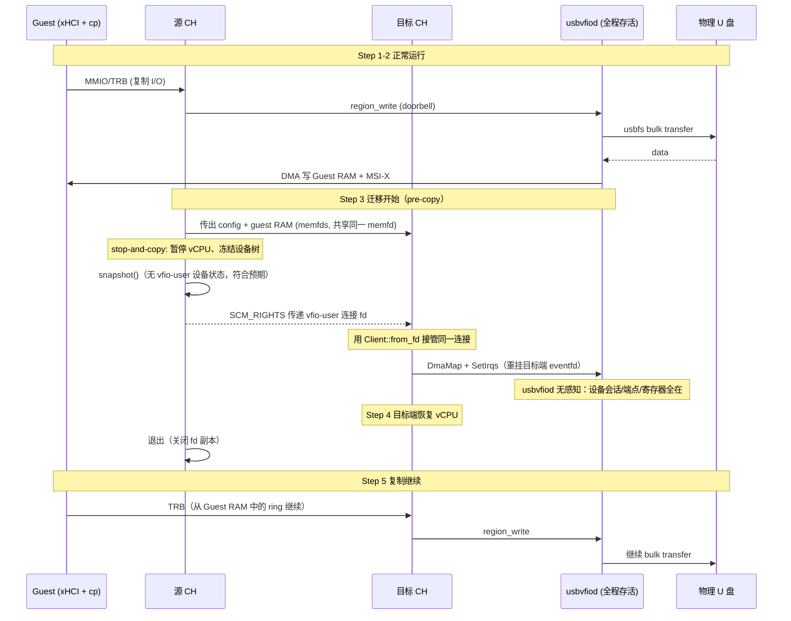

# USB 存储直通 Live Migration 演示方案（细化版）

> 版本：v1.0（基于主计划 `usb-vfiod-live-migration_cn.md` v1.0 + Phase 0 实验 B 实测结论）
> 日期：2026-09-20
> 实测基线：Cloud Hypervisor `v53.0-520-gc24527002`、usbvfiod `4d2c5af`（v0.3.0）、`vfio_user 0.1.5`
> 关联：R7/R9/R10/R11/R14/R16/R17；Phase 0 实验 B（`docs/phase0-exp-b-ch-vfio-user-migration_cn.md`）

---

## 0. 演示目标、范围与假设

**演示目标**：主机上一个 USB 存储设备（U 盘/移动硬盘）直通给 Guest；Guest 正在复制文件；此时对 Guest 做 CH live migration；迁移后 Guest 继续复制，**设备无断开、无 reset、无重枚举，复制不中断或最多一次可重试错误**。

**范围（已确认）**：**同主机** CH live migration（对应 R14）。跨主机的需求场景尚未明确，因此**本期不实现**，仅在 §11 给出技术方案展望（对应 R15）。

**假设**（若不成立需先确认）：
1. Guest 为 Linux（xHCI + usb-storage，systemd）。
2. 允许修改 Cloud Hypervisor（已 fork `yeungtuzi/cloud-hypervisor`）与 `vfio-user` crate。
3. 物理设备**不**在迁移过程中被拔出；不使用宿主键鼠接收器做测试设备。
4. 同主机迁移使用 `memory_mode=memfds`（主计划已定，且对本方案是关键前提）。CH 文档（`docs/live_migration.md:337-342`）明确：`memfds` 通过 UNIX socket 传递 Guest 内存的 **backing file descriptor**（要求内存区为 shared/hugepage 后端），即源/目标 **mmap 同一份共享内存**——这是 §5 不变量 2 的依据。

**已排除的干扰项**：等时设备、Windows Guest、USB 网卡——不作为首版 demo 设备。

---

## 1. 演示步骤与每步的可观测证据

> 原则：每一步都要有**可自动判定的证据**，不能只靠"看着没断"。观测三路并行：Guest 内、usbvfiod 侧、CH 侧。

### Step 0 — 前置（演示前一次性）
| 动作 | 命令/位置 | 期望 |
|---|---|---|
| 关闭 autosuspend | `usbcore.autosuspend=-1` | `/sys/bus/usb/devices/*/power/control` = `on` |
| 设备权限 | udev 规则或 root | usbvfiod 可 `O_RDWR` 打开设备节点 |
| 准备镜像 | `images/linux` + `images/initrd.gz`（已有） | 可启动带 shell 的 Guest |
| 采集开关 | `usbvfiod --pcap-path demo.pcap` | 记录全部 USB 传输 |

### Step 1 — 主机插设备，CH 指派给 Guest
```console
# host
lsusb                                  # 记录 BUS/DEV、VID:PID、序列号
lsusb -v -d <VID:PID> > host-lsusb-v.txt
usbvfiod --socket-path /run/usbvfiod.sock --hotplug-socket-path /run/hotplug.sock --pcap-path demo.pcap -v
# 方式 A：启动时直挂               方式 B：运行时热插
#   --device /dev/bus/usb/BBB/DDD     ./remote --socket /run/hotplug.sock --attach /dev/bus/usb/BBB/DDD
cloud-hypervisor --api-socket /run/ch1.sock --memory size=2G,shared=on \
  --kernel images/linux --initramfs images/initrd.gz --cmdline "console=ttyS0" \
  --serial file=guest-console.log --console off \
  --user-device socket=/run/usbvfiod.sock
```
**证据**：`ch-remote info` 的 `device_tree` 出现 `_vfio_user0`（BAR0=16K、BAR3=8K）；usbvfiod 日志出现设备 attach 与 speed 探测。

### Step 2 — Guest 内发现设备、挂载、开始复制
```console
# guest
lsusb; lsusb -v -d <VID:PID> > guest-lsusb-v-before.txt
dmesg | grep -iE 'xhci|usb-storage|sd '        # 记录 sdX 分配
mount /dev/sdX /mnt
dmesg -w > /tmp/dmesg-watch.log &              # 全程采集（关键！）
iostat -x 1 /dev/sdX > /tmp/iostat.log &       # 采集吞吐
cp /mnt/bigfile /root/bigfile.copy &           # 或 fio/rsync，记录 PID 与进度
```
**证据**：`/dev/sdX` 节点名；复制进程 PID；起始 `md5sum`（源文件）；`dmesg` 基线。

### Step 3 — HV 准备迁移，Guest 侧"暂停"、吞吐→0
```console
# host
ch-remote --api-socket /run/ch2.sock receive-migration receiver_url=unix:/run/mig.sock &
ch-remote --api-socket /run/ch1.sock \
  send-migration destination_url=unix:/run/mig.sock,memory_mode=memfds,downtime_ms=300,timeout_strategy=cancel
```
**证据**：`iostat` 吞吐掉到 0；`dmesg-watch.log` 在停顿窗口内**不得**出现 USB reset/`device descriptor read`；`ch-remote info` 源端状态进入 paused。

### Step 4 — 迁移 Guest OS
**证据**：目标端 `ch-remote info` → `state=Running`；源端进程退出；`device_tree` 仍有 `_vfio_user0` 且 PCI BDF/资源与源端一致。

### Step 5 — 新 Guest 继续复制，过程透明
```console
# guest（迁移后同一 shell/session）
# cp 仍在运行；或最多一次报错后自动/手动重试
md5sum /root/bigfile.copy /mnt/bigfile       # 一致即成功
dmesg | grep -iE 'usb|sd ' | tail -50        # 无 remove/add、无 reset
lsusb -v -d <VID:PID> > guest-lsusb-v-after.txt
diff guest-lsusb-v-before.txt guest-lsusb-v-after.txt   # 空
```
**证据**：`diff` 为空；`md5sum` 一致；`cp` 进程未重启（或仅一次可重试错误）。

---

## 2. 验收指标（可自动判定）

| 维度 | 判定项 | 通过阈值 | 采集来源 |
|---|---|---|---|
| **透明性（硬）** | 非请求 HCRST | `= 0` | usbvfiod pcap + guest dmesg |
| | Port Status Change Event (CSC/PRC/PSC) | `= 0` | pcap（事件环 TRB） |
| | `lsusb -v` 前后 diff | 空 | guest |
| | `/dev/sdX` 设备名 / 序列号 | 不变 | guest |
| | udev add/remove | `= 0` | guest `dmesg -w` |
| **I/O 正确性（硬）** | 目标文件 md5 | 与源一致 | guest |
| | lost / duplicated I/O | `= 0` | 校验和 + pcap 交叉验证 |
| **连续性（软）** | 复制进程是否重启 | 否 | guest `ps` |
| | 允许的 SCSI 重试错误次数 | `≤ 1` 且自动恢复 | guest dmesg |
| | 是否出现 `usb-storage` reset / `device offline` | `= 0`（出现即失败） | guest dmesg |
| **停机时间** | `downtime_ms` 实测 | 首版目标 `≤ 2000 ms` | CH 日志 + guest 停滞时长 |
| **可复现** | 连续跑 N=10 次 | 全绿 | 自动化脚本 |

> **关键判定边界**：Guest 的 `usb-storage`/SCSI 层重试是**允许**的（对应用户说的"报告一次错误要求重传"）；`usb-storage` 触发 **reset** 或端口 PRC 则**直接判失败**——那意味着 Guest 感知到了设备变化，违反 R4。

### 2.1 实测结果（2026-09-20）

脚本：`guest/usb-migration-demo.sh`；设备：32 GB exfat U 盘（`/dev/bus/usb/001/007`）；测试负载：Guest 从 U 盘复制 128 MiB 到本地盘，迁移在复制过程中发起。

| 指标 | 目标 | 实测（修复后 5/5） | 结论 |
|---|---|---|---|
| 停机时间 | ≤ 2000 ms | **4–18 ms** | ✅ 远超目标 |
| 复制跨越迁移 | 必须 | 复制窗口 20.6–35.3 s，迁移点落在其中 | ✅ |
| 目标文件 md5 | 与源一致 | 完全一致 | ✅ |
| 迁移后重枚举 | 0 | **0**（两次枚举均在开机 `[1.99s]`） | ✅ |
| `usb-storage` reset / I/O error | 0 | **0** | ✅ |
| Guest 存活 | 是 | 心跳持续、复制 `rc=0` | ✅ |
| 连续可复现 | N=10 | 修复后连续通过（累计 10 次，见 DEVLOG D8/D9） | ✅ |

> 过程中发现并修复了一个**时序相关**缺陷（交接窗口丢失中断），详见 `docs/DEVLOG_cn.md` D7/D8。这类缺陷单次通过不足以验收，必须重复试验。


---

## 3. 技术难点与 Phase 0 实验 B 的硬约束

实验 B 已实测确认（见 `docs/phase0-exp-b-ch-vfio-user-migration_cn.md`）：

1. **CH 不支持迁移 `--user-device`，且是死锁而非报错**：目标端 `device_manager.rs:4338-4341 → vfio_user::Client::new → negotiate_version → read_exact` 永久阻塞，根因是 `vfio_user-0.1.5/src/lib.rs:1393-1394` 的 `Server::run()` **只 `accept()` 一次**，而连接被源端持有。
2. **设备状态根本不会被搬运**：`VfioUserPciDevice` 的 `Pausable`/`Migratable` 是空实现，`snapshot()` 无 BAR/设备状态/DMA dirty。
3. **`timeout_strategy=cancel` 没有实现"失败后源端继续运行"**：源端在 ~200 s 内停在 `paused/migrating`（R16 的核心假设存疑，需单独验证）。
4. **物理设备状态不可序列化**：endpoint toggle、设备内部状态、SCSI sense 无法导出 → **设备会话必须由同一主机上的进程保活**（R10/R12）。

由 4 直接推出本 demo 的核心架构约束：

> **同主机 + usbvfiod（或 usbdev-agent）进程全程存活 = 设备会话天然保持；需要解决的只是"让 Guest 的控制器视角跨过 VMM 切换点"。**

---

## 4. 迁移路径选型

| 方案 | 思路 | 改动面 | 可演示性 | 跨主机 |
|---|---|---|---|---|
| **A. vfio-user 客户端 fd 交接**（★ demo v0 推荐） | 源 CH 把已建立的 vfio-user **连接 fd**（SCM_RIGHTS）交给目标 CH；目标端接管同一连接；usbvfiod 全程无感知 | `vfio-user` crate: `Client::from_fd`；CH: `receive-migration` 增加 `vfio_user_fds`，`add_vfio_user_device` 支持接管 | **高**（最短路径） | 否 |
| B. 断连重连 + usbvfiod 保持状态 | usbvfiod 循环 accept，客户端断开后**不重置**设备/控制器状态；目标端重连 | usbvfiod: 多连接循环 + 状态保持；CH: 目标端**延后**连接（改迁移时序） | 中（CH 时序改动大） | 否 |
| C. 协议级 migration / device-state region | usbvfiod 暴露 state region；CH 实现 `VfioUserClientWrapper` 的 migration_flags/state/dirty-log；状态导入导出 | 三方大改（主计划 Phase 1+3） | 低（周期长） | **是** |

**推荐**：
| **Demo v0 走方案 A**：最快拿到"透明迁移"的可演示结果，验证 demo 的 5 步叙事与验收指标。
- **方案 B 作为 A 的降级**（若 fd 交接在 CH/接口上受阻）。
- **方案 C 是产品路径**（主计划 Phase 3 原定内容），且是跨主机的唯一可行方向；**本期不实现**，仅在 §11 展望。

> 注意：方案 A 是**同主机专用捷径**，不实现 R2/R3 的状态格式，也不满足 R11（usbvfiod 重启）。它对 demo 足够，对产品不够——两者不要混为一谈。

---

## 5. 端到端时序（方案 A）



**不变量**（对应主计划 §5.3）：
1. usbvfiod 进程不重启、不重开设备节点、不 reset。
2. Guest RAM 是**同一个 memfd**（`memory_mode=memfds` + `shared=on`，依据 CH `docs/live_migration.md:337-342`）→ usbvfiod 已建立的 DMA 映射继续有效（usbvfiod 自己持有该 memfd 引用，源端退出也不影响）。
3. Guest RAM 里的 ring/context/dequeue pointer 不动 → 目标端从断点继续消费 TRB。
4. 目标端必须在**恢复 vCPU 之前**完成 `SetIrqs`，否则切换窗口内 usbvfiod 触发的中断会丢 → 需要 usbvfiod 侧"中断重发/挂起中断闩锁"或短暂 quiesce。

---

## 6. 任务分解（Demo 版 D0–D7）

> 与主计划 Phase 编号的对应关系写在"对应"列；`★` 表示 demo 必需，`○` 表示建议。

### D0 — 环境与基线 ★（大部分已完成）
- D0.1 KVM/usbfs/vfio 权限、CH 与 usbvfiod 构建 ✅（已完成）
- D0.2 Phase 0 实验 B：CH vfio-user 迁移支持边界 ✅（已完成，结论=不支持+死锁）
- D0.3 （补）**实验 B2**：`timeout_strategy=cancel` 的源端可恢复性 → R16 前置 ○
- **退出**：已知边界、可复现失败点。

### D1 — usbvfiod：保活与可观测性 ★
- D1.1 确认并补强"客户端切换不重置设备"：设备不会因连接变化被 reset/autosuspend（当前 `reset()` 是 `todo!()`，`dma_unmap` 是 `todo!()`，需按需实现或明确不触发）
- D1.2 中断路径加固：`SetIrqs` 更新时重发未决中断，避免切换窗口丢中断（对应 R4）
- D1.3 PCAP 采集与迁移标记（在 pcap 中标注迁移点，便于判定 CSC/PRC）
- **对应**：R4/R10；主计划 T1.2 的最小版
- **退出**：usbvfiod 在客户端重连/fd 接管场景下不 reset、不丢中断。

### D2 — `vfio-user` crate：连接可传递 ★
- D2.1 新增 `Client::from_fd(OwnedFd)`（或 `from_stream`），跳过 `Client::new` 的 connect，保留协商后的 client 状态
- D2.2 复查 `resettable` 解析取反 bug（crate `lib.rs:517`），决定是否一并修
- **对应**：R7 的前置
- **退出**：可从已建立 fd 构造 Client 并正常收发。

### D3 — CH：user-device fd 交接 ★
- D3.1 `receive-migration` 支持 `vfio_user_fds`（对齐现有 `vfio_fds` 机制）
- D3.2 `add_vfio_user_device`（`vmm/src/device_manager.rs:4304`）：有 fds 时走 `Client::from_fd`，否则保持原路径
- D3.3 源端导出连接 fd 的 API（或经 ch-remote 用 SCM_RIGHTS 传递）
- D3.4 目标端在 `VfioUserPciDevice::new` 中重做 DmaMap/SetIrqs
- **对应**：R7；主计划 T3.2 的同主机子集
- **退出**：同主机迁移不再死锁，目标端 `state=Running`。

### D4 — 在途 I/O 与边界正确性 ★
- D4.1 暂停前 drain：停止消费新 TRB，给在途 bulk transfer 一个有界窗口（默认 2000 ms）
- D4.2 未完成传输留在 ring，恢复后从 dequeue pointer 继续（不在 Guest RAM 里改任何指针）
- D4.3 失败/超时 → 允许 Guest SCSI 层重试（≤1 次），但**不得**触发 reset
- **对应**：R4/R5/R9；主计划 T1.2 + T3.3 的最小版
- **退出**：pcap 显示边界无丢/重，Guest dmesg 无 reset。

### D5 — Guest 侧观测与透明性验证 ★
- D5.1 Guest 内采集脚本：`dmesg -w`、`lsusb -v`、`/dev/sdX`、`iostat`、复制进程存活
- D5.2 前后 diff + md5 校验自动化
- D5.3 迁移点标记（在 pcap/dmesg 时间轴上对齐）
- **对应**：R17
- **退出**：一条命令产出"通过/失败"判定。

### D6 — 演示脚本与自动化 ★
- D6.1 `scripts/demo/usb-storage-migration-demo.sh`：一键跑完 Step 1–5 并输出指标表
- D6.2 连续 N=10 次回归，统计成功率与 downtime 分布
- **退出**：可重复演示、失败可定位。

### D7 — （增强）guest-cooperative 变体 ○
- D7.1 PV 控制块 `PV_HOST_REQ` + Guest helper（主计划 §6.2 / 附录 A）
- D7.2 在 stop-and-copy 前完成 USB 层 quiesce，把"掉速+可能一次重试"收敛为"纯掉速"
- **对应**：R6/R8/R9
- **退出**：长停机窗口下仍无重试错误（可选加分项，不阻塞 demo v0）。

---

## 7. 对主计划的修订建议（重要）

| 主计划条目 | 现状 | 建议修订 |
|---|---|---|
| §6.3 关键未知"CH 对 vfio-user migration 的支持边界" | **已由实验 B 关闭** | 改为事实陈述：不支持且死锁；同主机走 fd 交接，跨主机走 state region |
| R7 | "实现并集成 vfio-user migration 模型到 CH" | 拆成 **R7a 同主机 fd 交接**（本期 demo）与 **R7b 协议级 state region**（跨主机，需求明确后再启动，本期仅展望） |
| R14 | 无具体验收 | 引用本 demo §2 的指标表 |
| R16 | 假设 `cancel` 后源端继续运行 | **实验 B 反例**：需先做 D0.3 验证并修复源端恢复 |
| §9 Phase 3 | 直接做 migration region | 前置 **Phase 3a 同主机 fd 交接 demo**，再进 3b |
| §14 风险表"CH/rust-vmm 缺支持 高" | 已确认 | 降级为"已确认事实 + 缓解=补丁"，新增风险"中断切换窗口丢失" |
| §11 文件清单 | 未含 crate 改动 | 增加 `vfio-user` crate 的 `Client::from_fd` |

---

## 8. 演示前置条件清单（Checklist）

- [ ] 专用 USB 存储设备（**不要**用宿主键鼠/BMC 虚拟键鼠）
- [ ] `usbcore.autosuspend=-1`，设备 `power/control=on`
- [ ] Guest 镜像可启动且带 `lsusb`/`md5sum`/`iostat`
- [ ] `memory_mode=memfds` + `--memory shared=on`
- [ ] usbvfiod `--pcap-path` 开启
- [ ] Guest `dmesg -w` 全程采集
- [ ] 源/目标 CH 均 `-v` 日志
- [ ] 大文件（建议 ≥1 GB）保证复制跨越迁移窗口

---

## 9. 失败判定与降级

| 现象 | 判定 | 处置 |
|---|---|---|
| Guest dmesg 出现 USB reset / `device offline` / udev remove+add | **失败** | 停止，抓 pcap + dmesg 定位；检查是否走了 reset 路径 |
| `/dev/sdX` 改名或 `lsusb -v` diff 非空 | **失败** | 同上 |
| md5 不一致 | **失败** | 检查在途 I/O 边界语义与重试幂等性 |
| 复制报错 >1 次 | 部分成功 | 记录，按 D4/D7 收敛 |
| 迁移挂起（当前 CH 原生行为） | **已知失败** | 走方案 A；确认 D3 已生效 |
| 迁移失败后源端不恢复 | **R16 风险** | 先做 D0.3；必要时改 CH 回滚时序 |

---

## 10. 与用户叙事的对应

| 用户描述 | 本方案中的实现点 |
|---|---|
| 1. 主机插 U 盘，CH 指派给 Guest | Step 1；`--user-device socket=usbvfiod.sock` |
| 2. Guest 发现设备、挂载、开始复制 | Step 2；`lsusb`/`dmesg`/`mount`/`cp` |
| 3. HV 准备迁移，Guest 接到通知，硬盘暂停、速度变为 0 | Step 3；v0 = vCPU 暂停导致 I/O 停顿（D7 增强为显式 quiesce 通知） |
| 4. 迁移 Guest OS | Step 4；方案 A 的 fd 交接 + memfds 共享内存 |
| 5. 新 Guest 继续复制，仅掉速或一次重传，过程透明 | Step 5；§2 验收指标保证"无 reset/重枚举"，允许 ≤1 次 SCSI 重试 |

---

## 11. 跨主机技术方案展望（仅展望，本期不实现）

> 触发条件：跨主机迁移的需求场景明确后再启动。本节只做技术可达性与限制判定，**不产生本期实现任务**。

### 11.1 问题本质

物理 USB 设备与 **host kernel 会话**（endpoint toggle、设备内部状态、SCSI sense、interface claim）**不可序列化**，也无法跨主机复制。因此跨主机的关键不是"搬运设备"，而是**目标主机能否获得等效资源**。这决定了跨主机在当前架构下**无法做到 zero-perception**。

### 11.2 候选路线

| 路线 | 思路 | 前置依赖 | 主要限制 |
|---|---|---|---|
| **C1. 协议级 device-state region** | usbvfiod 暴露 device-state/migration region 导出 `ControllerState`；CH 实现 `VfioUserClientWrapper` 的 migration_flags/state/dirty-log；目标端 usbvfiod 导入状态并绑定**本地等效设备** | R7b + R2/R3 状态格式 + `usbdev-agent` | host-session 状态搬不过去，需设备级重建 + 上层幂等重试；适用于**存储类**（Guest 侧重挂载可恢复逻辑状态） |
| **C2. USB/IP** | 设备留源主机，`usbip` 导出，目标主机 `vhci-hcd` 接入；usbvfiod 后端改为访问 vhci | 源主机在线、网络带宽/延迟、`vhci-hcd` | 与 xHCI 模型叠加复杂；链路中断即设备丢失；不适合大文件持续吞吐 |
| **C3. virtio-usb（未来）** | 复用 USB/IP + `vhci-hcd` 思路，把 TCP 换为 VirtIO 传输 | 上游实现（当前多为 stub） | 生态未成熟 |
| **C4. 兜底：热拔 + 热插** | 迁移前 detach、迁移后 attach | 无 | Guest 必然看到 disconnect/re-enumerate，**违反 R4**，仅作降级演示 |

### 11.3 判定要点

1. **设备类别差异大**：存储类可通过 Guest 侧重挂载恢复逻辑状态；HID / 实时 / 有状态设备更差。
2. **在途 I/O 无法跨主机续传**：必须依赖上层协议幂等 + 重试，存在重复写风险。
3. **停机窗口显著更长**：设备重建 + 枚举 + 重挂载，远大于同主机 demo 的毫秒级 blackout。
4. **zero-perception 不可达**：除非目标端使用"同一物理设备 + 同一 host 会话"，而这正是同主机场景。

### 11.4 结论

- **同主机**：方案 A（fd 交接）可做到接近零感知，是本 demo 的目标。
- **跨主机**：当前架构下只能做到"**可恢复但不透明**"；若要提升透明度，必须先落地 C1 的状态模型（R7b）并接受设备级重建。需求明确前不投入实现。
