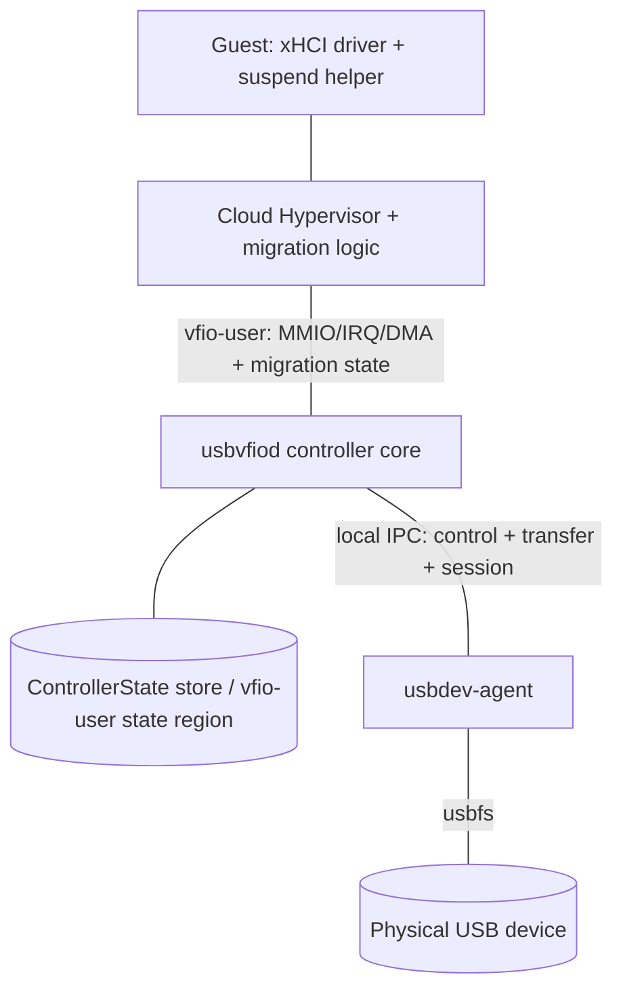
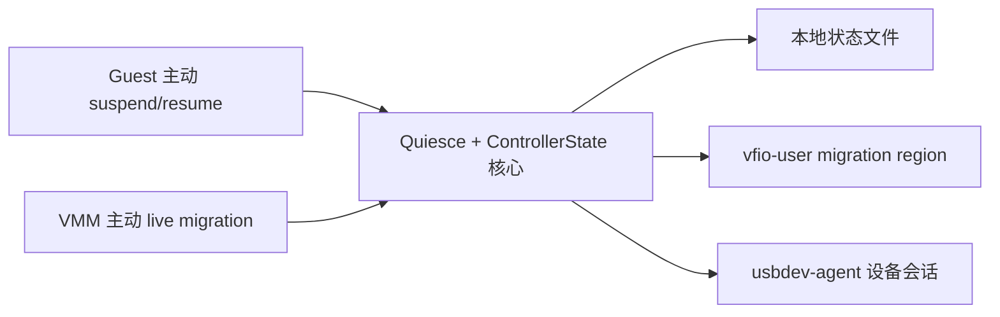

# usbvfiod 设备状态保持与迁移工作计划（休眠/唤醒 + 迁移）

| 项目 | 内容 |
|---|---|
| 状态 | 合并版计划（待评审） |
| 版本 | v2.1（统一次休眠/迁移生命周期） |
| 合并来源 | 来源 A：本机休眠/唤醒需求（R1–R5，已在 v1.0 固化）；来源 B：`docs/ziyi-fu-discuss-for-da.md`（Ziyi Fu 迁移论文提案） |
| 范围 | **已承诺**：本机休眠/唤醒、本机快照/恢复、**本机 live migration**、controller/agent 重启；**可行性研究**：跨主机迁移 |
| 目标组件 | `usbvfiod`、新增 `usbdev-agent`、Guest helper/driver、必要时的 Cloud Hypervisor / rust-vmm 集成 |
| 相关文档 | `docs/developers/architecture.md`、`docs/users/systemd.md`、`docs/users/security.md`、`docs/ziyi-fu-discuss-for-da.md` |

---

## 0. 两份来源的对比与合并结论

### 0.1 定位差异

| | 来源 A（本计划 v1.0） | 来源 B（论文提案） |
|---|---|---|
| 目标 | Guest 主动的**休眠/唤醒** | VM 级 **live migration** 中外部设备状态的迁移 |
| 触发者 | Guest OS / helper | VMM（Cloud Hypervisor）迁移流程 |
| 传输基线 | 本机状态文件 + agent 重绑定 | **vfio-user migration 模型**（协议 region + 迁移状态机） |
| 场景 | 仅本机 | 同主机 + **跨主机可行性研究** |
| 交付 | 工程实现 | 论文（RQ、相关工作、评估、22 周时间线） |

两者共享一个内核：**"外部设备相关状态在何处、如何被 quiesce、保存、恢复/重建"**，因此可以合并为一个统一的"设备状态保持"计划，用两条前端路径接入同一个状态核心。

### 0.2 同类项（合并）

| 合并项 | A 的对应 | B 的对应 |
|---|---|---|
| 状态盘点与分类 | §6.1 状态分类 | Design#2 Identify migration-relevant state |
| 状态格式与保存/恢复 | §6.2 `ControllerState` | Design#3 + "state format" |
| Quiesce 与在途 I/O | §5.5 在途传输策略 | Design "quiescing"、无 lost/duplicated I/O |
| VMM 集成 | vfio-user region / agent / CH 重连 | CHV ↔ usbvfiod migration path through vfio-user |
| Guest 无感知 | R5（CSC/PRC=0、无重枚举） | "without unnecessary disconnect/re-enumeration" |
| 评估 | §11 测试与验收 | Evaluation（正确性、连续性、限制） |
| 物理设备/宿主资源限制 | R3 + host 不可序列化状态 | "host-side USB access tied to local resources" |
| 同主机场景 | 唯一场景 | 评估项之一 / 可行性回退 |

### 0.3 来源 B 新增项（纳入）

1. **VMM 主动 live migration**：迁移生命周期（迭代拷贝、停机窗口、脏数据收敛），而非 Guest 休眠。
2. **vfio-user migration 协议基线**：device-state region、迁移状态机与数据传输语义，以及 **Cloud Hypervisor / rust-vmm 侧集成**（可能需要改上游）。
3. **跨主机迁移可行性研究**：物理设备不可复制时，目标主机如何获得等效 USB 资源、限制条件与替代方案。
4. **迁移失败/回滚**：迁移失败后源主机继续正确运行。
5. **QEMU/KVM 对照**：作为更成熟的迁移实现参考。
6. **替代暴露路径**：USB/IP、virtio-usb（相关工作/未来工作）。
7. **学术交付物**：研究问题、相关工作、评估方法、22 周时间线。

### 0.4 来源 A 保留项

1. Guest 主动 **suspend/hibernate** 路径（标准 PCI PM + paravirtual ABI + Guest helper）。
2. 长生命周期 **`usbdev-agent`**：设备会话保持、`usbvfiod` 可独立重启/升级不丢设备。
3. **硬性零感知指标**：CSC/PRC=0、非请求 HCRST=0、udev 无 remove/add。
4. **S3/S4** 场景与 host 侧"不 reset/不断开/不 autosuspend"约束。
5. 代码级差距、**文件级改动清单**、依赖许可证约束。

### 0.5 统一模型：休眠/唤醒与迁移不是竞争关系

来源 A 与来源 B 描述的是**同一个 quiesce/resume 生命周期的两种触发方式**，范围上并不冲突：

- **Guest 主动休眠（S3/S4）**：Guest 完整挂起，控制器保持状态，恢复后继续；停机窗口很长。
- **VMM 主动 live migration**：pre-copy 阶段 Guest 继续运行；stop-and-copy 阶段暂停 vCPU（blackout）、快速同步最后的内存差异，然后在目标端恢复执行。这个"暂停—同步—恢复"正是同一个 quiesce/resume，只是窗口很短。

因此两者共用同一套状态核心与状态机，差别只在**触发者、停机窗口长度、以及物理设备资源是否可达**。真正需要取舍的只有：

| 真实取舍 | 结论 |
|---|---|
| 状态传输机制 | 以 vfio-user migration region 为主线；本机状态文件/agent 作为 Guest 休眠与降级路径 |
| 跨主机物理资源 | 同主机为承诺交付；跨主机为可行性研究（物理设备不可复制） |
| 时间线 | 论文核心收敛为"控制器状态经 vfio-user 迁移 + 同主机验证" |

> 需要补充的技术细节：**stock live migration 并不会通知 Guest OS 进入 suspend**，它只是暂停 vCPU。要让物理 USB 的在途 I/O 优雅收敛、避免重枚举，需要 Guest 配合（paravirtual 通知或标准 PM 前置 quiesce），这正是本计划要补的能力，而**不是 CH 的现成行为**。统一生命周期见 §4.0，迁移阶段的映射见 §4.2。

### 0.6 合并后的范围与非目标

- **范围内**：状态盘点与格式；quiesce；状态保存/恢复/重连；Guest 休眠/唤醒；VMM live migration（同主机）；`usbdev-agent`；迁移失败/回滚；跨主机可行性分析；评估与论文。
- **非目标（本期不承诺实现）**：跨主机"透明"迁移物理设备；USB/IP、virtio-usb 的实现（仅分析与未来工作）；非 Linux Host；等时（isochronous）支持（另一条线）。

---

## 1. 合并后的需求

> 标签：[A] 来自休眠/唤醒需求；[B] 来自迁移论文提案；[A+B] 两者共有。

### 1.1 状态与语义

| ID | 需求 | 来源 |
|---|---|---|
| MR1 | 完成 usbvfiod 迁移相关状态盘点与分类（controller-private / guest-RAM / host-session / agent），产出 inventory 文档 | [A+B] |
| MR2 | 定义版本化、可校验、前向兼容的状态格式（`schema_version` + `abi_version` + CRC） | [A+B] |
| MR3 | 状态可完整保存、恢复、重连；同一状态格式服务于休眠与迁移两条路径 | [A+B] |
| MR4 | 边界处 I/O 不丢、不重、无意外 disconnect/re-enumeration | [A+B] |
| MR5 | 支持 VMM 迁移生命周期语义（pre-copy / stop-and-copy、停机窗口、收敛与脏处理） | [B] |

### 1.2 触发与传输

| ID | 需求 | 来源 |
|---|---|---|
| MR6 | Guest 主动 suspend/resume：标准 PCI PM 与 paravirtual ABI + Guest helper | [A] |
| MR7 | VMM 主动迁移：实现并集成 vfio-user migration 模型到 Cloud Hypervisor（必要时含 rust-vmm 改动） | [B] |
| MR8 | Guest 休眠与 VMM 迁移复用同一 quiesce/resume 生命周期与状态核心（§4.0），语义一致 | [A+B] |

### 1.3 设备与主机资源

| ID | 需求 | 来源 |
|---|---|---|
| MR9 | `usbdev-agent` 保持设备会话：不 reset、不断开、不 autosuspend、保持 claim | [A] |
| MR10 | `usbvfiod` 可独立重启/升级而不丢设备（由 agent 保活） | [A] |
| MR11 | 分析并设计 usbvfiod ↔ Linux kernel/物理设备的迁移机制（additional work） | [B] |

### 1.4 场景与边界

| ID | 需求 | 来源 |
|---|---|---|
| MR12 | 同主机：S3/S4、CH 快照/恢复、controller/agent 重启 | [A] |
| MR13 | 同主机 live migration | [B] |
| MR14 | 跨主机迁移可行性判定；不可行时给出限制分析与替代方案 | [B] |
| MR15 | 迁移失败/回滚：失败后源主机继续正确运行，Guest 不损坏 | [B] |

### 1.5 评估、交付与约束

| ID | 需求 | 来源 |
|---|---|---|
| MR16 | 评估：状态正确性、I/O 连续性、停机时间、兼容性、遗留限制 | [B] |
| MR17 | 参考/对照：QEMU/KVM 作为 reference；USB/IP、virtio-usb 作为未来工作 | [B] |
| MR18 | 工程与论文文档交付（含研究问题回答） | [A+B] |
| MR19 | 仅引入非 GPL/非传染性依赖，落在 `deny.toml` 白名单内 | [A] |
| MR20 | 安全与权限：状态文件、agent、Guest helper 的最小权限与完整性 | [A] |

---

## 2. 目标与验收/评估标准

### 2.1 功能验收

| 需求 | 验收标准 |
|---|---|
| MR6 Guest 休眠/唤醒 | 标准 PM 与 paravirtual 两条路径均可完成握手；失败可中止并重试 |
| MR12 同主机休眠/快照/重启 | resume 后寄存器与内部状态逐字段一致；I/O 可继续 |
| MR13 同主机迁移 | 迁移后 Guest 继续使用同一虚拟控制器；无重枚举 |
| MR3/MR4 状态与 I/O | `lsusb -v` 前后一致；无 udev remove/add；**CSC/PRC=0，非请求 HCRST=0**；无 lost/duplicated I/O |
| MR15 回滚 | 迁移失败后源端继续正常运行，Guest 状态一致 |
| MR9/MR10 设备会话 | 休眠与 `usbvfiod` 重启期间 fd 保持、claim 保持、`power/control=on` |

### 2.2 评估指标（论文）

1. **状态正确性**：保存/恢复字段级比对；Guest 视角设备树与句柄不变。
2. **I/O 连续性**：迁移/挂起边界前后块设备 fio/校验和无丢失、无重复。
3. **停机时间**：live migration 的 downtime 测量与收敛行为。
4. **无中断性**：CSC/PRC=0、udev 事件=0。
5. **兼容性**：USB storage / HID / serial 等类别分别验证。
6. **限制**：跨主机、物理设备不可复制、在途传输语义、类别差异。
7. **迁移变体对比**：guest-cooperative 与 vCPU-pause only 在正确性、I/O 连续性、停机时间上的差异。

---

## 3. 目标架构

### 3.1 组件



| 组件 | 职责 |
|---|---|
| Controller core | xHCI 仿真；quiesce；状态导入导出；paravirtual/PM 寄存器 |
| Migration adapter | 通过 vfio-user migration 模型与 CH 交互（state region、迁移状态机） |
| `usbdev-agent` | 持有 fd/claim/endpoint；设备会话保活；禁止 reset/autosuspend |
| Guest helper | Guest 主动休眠握手 |
| CH/rust-vmm（可能改动） | 迁移编排、状态搬运、设备生命周期 |

### 3.2 两条前端、一个核心



### 3.3 不变量

1. Agent 是物理设备会话的唯一所有者。
2. 任何挂起/迁移路径不得 `reset`/`clear_halt`/重开设备节点。
3. 任何恢复路径不得置 PORTSC 的 CSC/PRC/PSC。
4. 状态格式唯一，两条路径共用；版本不匹配必须拒绝加载并报错。

---

## 4. 协议

### 4.0 统一 quiesce/resume 生命周期

三种触发方式映射到同一个状态机：

| 触发 | 进入 quiesce 的时机 | 停机窗口 | Guest 感知 |
|---|---|---|---|
| Guest 系统休眠（S3/S4） | Guest helper 发起 `PREPARE/ENTER`；内核随后执行 PCI D3 | 长（直到唤醒） | 明确休眠/唤醒 |
| VMM migration（guest-cooperative） | VMM 在 stop-and-copy 前请求 Guest quiesce（见下），再暂停 vCPU | 短（blackout） | 无（仅时间跳跃） |
| VMM migration（vCPU-pause only） | 随 vCPU 暂停直接 freeze 控制器 | 短 | 无 |

统一状态机：`RUNNING → PREPARING → READY → SUSPENDED/FROZEN → RESUMING → RUNNING`，并与 vfio-user migration 的 `PRE_COPY / STOP_COPY / STOP / RESUMING` 对齐（具体命名以 Phase 0 确认的规范为准）。

**guest-cooperative 迁移的请求通道**：VMM 通过 vfio-user migration 状态告知 usbvfiod 迁移开始 → usbvfiod 在 paravirtual 控制块置"host 请求 quiesce"位（附录 A 的 `PV_HOST_REQ`）→ Guest helper 轮询到后完成 USB 层 quiesce 并写 `PREPARE_SUSPEND`/`ENTER_SUSPEND` → usbvfiod 变为 READY 并通过 migration 状态回报 VMM → VMM 随即暂停 vCPU 完成 stop-and-copy。这样在途 I/O 在 blackout 之前就已收敛。

### 4.1 Guest 主动 suspend/resume（[A]）

- 标准 PCI PM：PM capability + PMCSR（D0/D3hot、PME），配置空间写回调。
- Paravirtual：厂商 xECP + BAR0 控制块（附录 A），`PREPARE/ENTER/ABORT/RESUME` 状态机。
- Guest helper：`systemd-sleep` hook（pre/post），失败非零退出以中止休眠。
- 详见 v1.0 §5.1–§5.6（保留不变）。

### 4.2 VMM 主动 migration（[B]，主线）

以 vfio-user migration 模型为基线：

1. **能力协商**：controller 向 CH 报告支持迁移的 region 与迁移状态集合。
2. **迁移状态机**（对齐 vfio-user 规范/CH 现有框架）：`RUNNING → PRE_COPY → STOP_COPY → STOP → RESUMING → RUNNING`（具体命名以 Phase 0 确认的规范为准）。
3. **pre-copy 阶段**：允许 Guest 继续运行；controller 支持可重复的状态快照（增量或全量，取决于 vfio-user 语义）。
4. **stop-and-copy**：quiesce；收敛在途 I/O；导出最终状态；记录 dequeue pointer 等。
5. **目标端恢复**：加载状态；重建 worker；重新绑定设备会话（目标端 agent）或建立等效资源；不产生端口变更事件。
6. **源端清理 / 回滚**：成功后释放；失败则源端解除 quiesce 继续运行（MR15）。

> 与 Guest 休眠的统一：迁移的 **stop-and-copy** 对应 `PREPARING → READY → SUSPENDED`，目标端 `RESUMING → RUNNING` 对应唤醒。若采用 **guest-cooperative** 变体，VMM 会在暂停 vCPU 之前经 §4.0 的通道请求 Guest 先完成 USB 层 quiesce，从而把在途 I/O 收敛在 blackout 之前；若采用 **vCPU-pause only** 变体，则由控制器在 vCPU 暂停瞬间直接 freeze，并在目标端恢复未完成事务。

> 关键未知（Phase 0）：CH/rust-vmm 当前对 vfio-user migration 的支持边界；是否需要上游补丁。若不可用，本机场景回退到"本地状态文件 + agent 重绑定"。

### 4.3 Quiesce 与在途 I/O 策略（[A+B]）

- 停止接受新工作；等待在途 URB 完成（上限 `DEADLINE_MS`，默认 2000 ms）。
- 未提交的 TRB 留在 ring，恢复后从保存的指针继续。
- 超时/仍有排队工作：
  - Guest 路径：`BUSY_RETRY`，helper 中止并重试。
  - 迁移路径：延长 stop-and-copy 停机窗口（若框架允许）或取消 URB 并让 Guest 重试；迁移失败则回滚。
- 取消**不 reset 设备**；OUT 部分生效的语义限制必须文档化。

### 4.4 失败与回滚（[B]）

- 源端在收到迁移成功确认前**不得**释放设备会话与状态。
- 迁移失败：源端 `RESUME`，恢复 worker 与设备会话，Guest 继续运行；记录并上报失败原因。
- 目标端失败：清理已加载状态，不占用设备资源。

### 4.5 zero-perception 保证（[A+B]）

1. 冻结 PORTSC/PORTPMSC 并原值返回。
2. 不改变 slot/endpoint context 与 dequeue pointer。
3. 幂等处理 Guest 驱动在 resume 时重写的寄存器。
4. 不产生 Port Status Change Event。
5. 恢复后重新校验 Guest RAM（DMA map 重建）再放行。
6. Guest 前置条件：避免 `XHCI_RESET_ON_RESUME`（Phase 0 确定配置或使用定制驱动）。

---

## 5. 状态模型与持久化

### 5.1 状态分类（合并 A §6.1）

| 类别 | 内容 | 处理 |
|---|---|---|
| Controller 私有 | PCI config + MSI-X + PMCSR、USBCMD/USBSTS/CRCR/DCBAAP/CONFIG、PORTSC/PORTPMSC、IMAN/IMOD/ERSTSZ/ERSTBA/ERDP、EventRing 生产者状态、CommandRing 状态、slot/endpoint worker 状态、在途 TD | 序列化为 `ControllerState` |
| Guest RAM 内 | DCBAA、Device/Input Context、传输环、ERST、事件环内容 | 不重复保存；恢复时按地址引用并校验 |
| Host kernel/device | 设备配置、endpoint toggle、设备内部状态 | **不可序列化**；靠 agent 保持 fd/claim、不 reset 保全 |
| Agent 会话 | session id、设备标识、claim、已打开 endpoint | agent 侧保持；跨 controller 重启保留 |

### 5.2 状态格式与传输

- `ControllerState`：版本化 + CRC + UUID + DMA 段摘要（附录 B）。
- **两条传输通道**：
  1. **vfio-user migration region / device-state region**（迁移主线，[B]）；
  2. 本机状态文件 `/run/usbvfiod/<uuid>/state.bin`（Guest 休眠与降级路径，[A]）。
- 原子写入（temp→fsync→rename）；权限 `0600`/目录 `0700`；读取时校验版本与 CRC。
- 前向兼容：未知字段忽略；版本不匹配拒绝加载并报错。

### 5.3 跨主机状态语义（[B]）

- **Guest RAM** 随 VM 迁移（CH 负责）。
- **Controller 私有状态** 通过 vfio-user migration region 搬运。
- **Host 设备会话** 无法搬运 → 目标主机需要等效资源（见 §6.3）。

---

## 6. 设备与主机资源：同主机 vs 跨主机

### 6.1 `usbdev-agent`（[A]，迁移中也复用）

- 持有 fd/claim/endpoint；禁 autosuspend；不 reset。
- 与 controller 通过本地 IPC 解耦（`AgentRealDevice` 代理现有 `RealDevice` trait）。
- controller 重启时按 `session_id` 重新绑定。

### 6.2 同主机

- 休眠/快照/迁移都保持同一 agent 会话，源=目标。
- `usbvfiod` 可重启，agent 保活设备。

### 6.3 跨主机可行性分析（[B]，MR14/MR11）

物理设备不可复制，目标主机必须获得等效 USB 资源。候选机制：

| 机制 | 思路 | 代价/限制 |
|---|---|---|
| 目标端本地同型设备 | 目标 agent 打开本地设备，迁移软件状态 | 不是"迁移设备"；设备内部状态（toggle/配置）需重建；适用存储类 |
| USB/IP | 设备留源主机，经 USB/IP 导出，目标 `vhci-hcd` 接入 | 源主机必须在线；网络延迟/带宽；与 xHCI 模型叠加复杂 |
| virtio-usb（未来工作） | 复用 USB/IP + vhci-hcd，替换 TCP 为 VirtIO 传输 | 上游多为 stub，早期阶段 |
| 不支持 | 迁移前热拔出、迁移后热插入 | Guest 会看到 disconnect/re-enumerate，违反 MR4 |

**判定要点**：设备内部状态不可复制；类别差异（存储可重挂载恢复逻辑状态，HID/实时设备更差）；在途 I/O 无法跨主机续传。Phase 5 给出明确结论（回答论文 RQ4）。

---

## 7. 工作分解

### Phase 0 — 调研、行为验证与设计冻结（论文 Weeks 1–4）
- T0.1 [B] 分析 vfio-user migration 规范、QEMU 实现、CH/rust-vmm 相关 draft PR。
- T0.2 [A+B] 确认 CH 对 vfio-user migration 的支持边界与所需改动。
- T0.3 [A] 实测 stock Guest S3/S4 的 xhci 寄存器/命令序列与是否重枚举。
- T0.4 [A+B] 状态盘点（MR1）与需求确认。
- T0.5 [B] 同主机/跨主机可行性前置分析、物理资源模型。
- T0.6 [A+B] 冻结 paravirtual ABI v1 与 `ControllerState` schema v1。
- **退出**：支持度地图、状态 inventory、需求/范围、go-no-go、论文初稿启动。

### Phase 1 — 状态核心：quiesce + 序列化 + 零感知（Weeks 5–10）
- T1.1 [A+B] `ControllerState` + 序列化 + 版本/CRC。
- T1.2 [A+B] `SuspendCoordinator`/quiesce 广播 + 在途 I/O 策略。
- T1.3 [A+B] 端口/context 冻结 + zero-perception 保证。
- T1.4 [A+B] 多 worker 快照一致性 barrier。
- T1.5 [A+B] 单元测试。
- **退出**：状态往返正确；quiesce 在单元层面可验证。

### Phase 2 — Guest 主动路径（[A]，Weeks 5–10 设计 / 11–14 实现）
- T2.1 PCI PM capability + 配置空间写回调。
- T2.2 厂商 xECP + 控制块 ABI。
- T2.3 参考 Guest helper（systemd-sleep hook）。
- T2.4 S3/S4 集成测试（含 busy→retry）。
- **退出**：确定性 Guest 休眠/唤醒。

### Phase 3 — VMM 迁移路径（[B]，Weeks 5–10 设计 / 11–14 实现，主线）
- T3.1 usbvfiod 侧 vfio-user migration/device-state region 实现。
- T3.2 CH / rust-vmm 集成（能力协商、状态搬运、生命周期）。
- T3.3 迁移状态机（pre-copy / stop-and-copy / downtime）。
- T3.4 失败与回滚（MR15）。
- T3.5 同主机 live migration 原型。
- **退出**：同主机迁移后 Guest 可继续使用设备，无重枚举。

### Phase 4 — 设备会话与物理资源（[A+B]，Weeks 11–18）
- T4.1 `usbdev-agent` 拆分 + IPC + `AgentRealDevice`。
- T4.2 `usbvfiod` 独立重启/升级验证。
- T4.3 物理设备处理：同主机绑回；跨主机候选机制实验。
- T4.4 跨主机可行性实验与结论。
- **退出**：kill/restart usbvfiod 无断连；跨主机结论成文。

### Phase 5 — 评估与对照（[B]，Weeks 15–18）
- T5.1 功能/正确性/连续性/停机时间评估（MR16）。
- T5.2 失败与边界测试（回滚、agent 崩溃、设备拔出）。
- T5.3 QEMU/KVM 对照（MR17）。
- T5.4 跨主机限制与替代方案结论。
- **退出**：评估报告。

### Phase 6 — 加固、文档与论文（Weeks 19–22）
- T6.1 故障注入与安全评审（MR20）。
- T6.2 用户/开发/运维文档。
- T6.3 论文撰写与答辩准备（MR18）。
- **退出**：验收矩阵全绿；论文定稿。

---

## 8. 时间线（工程 + 论文映射）

| 论文周 | 阶段 | 主要交付 |
|---|---|---|
| 1–4 | Phase 0 | 支持度地图、状态 inventory、需求与范围、初稿启动 |
| 5–10 | Phase 1 + Phase 2/3 设计 | 状态核心；休眠与迁移的设计；迁移生命周期 |
| 11–14 | Phase 2/3 实现 | Guest 休眠路径 + usbvfiod migration + CH/rust-vmm 集成原型 |
| 15–18 | Phase 4/5 | 连续性/停机/回滚/限制评估；跨主机结论；扩展 |
| 19–22 | Phase 6 | 文档、论文、答辩 |

> 工程完整版（含 agent 全面拆分、跨主机机制探索）可能超出 22 周；论文核心建议收敛为"控制器状态经 vfio-user 迁移 + 同主机验证"，物理设备/跨主机作为分析章节与未来工作。

---

## 9. 文件级改动清单

| 文件/组件 | 改动 | 来源 |
|---|---|---|
| `src/device/pci/{constants,config_space,register_set,xhci}.rs` | PM capability/PMCSR、写回调、suspend/resume 钩子 | [A] |
| 新增 `src/device/xhci/suspend.rs` | SuspendCoordinator、状态机、quiesce | [A+B] |
| `src/device/xhci/{command_ring,slot_manager,interrupter,port,endpoint}.rs` | freeze/unfreeze、状态导入导出 | [A+B] |
| 新增 `src/state.rs` | `ControllerState`、序列化、版本/CRC | [A+B] |
| `src/xhci_backend.rs` | vfio-user migration/device-state region、`reset`/`dma_unmap`、DMA 校验 | [A+B] |
| 新增 `src/migration/` | 迁移状态机、CH 交互适配 | [B] |
| Cloud Hypervisor / rust-vmm | 若上游缺 migration 支持，提交补丁（Phase 0 判定） | [B] |
| 新增 `src/agent/`（或独立 crate） | usbdev-agent、IPC、`AgentRealDevice` | [A+B] |
| 新增 `src/device/xhci/paravirt.rs` | 厂商 xECP 与控制块 | [A] |
| `src/main.rs`、`src/cli.rs` | 状态文件、agent socket、迁移参数 | [A+B] |
| `Cargo.toml` | `serde` + 二进制格式 + CRC 等 | [A+B] |
| `nix/checks/*` | 休眠/唤醒、快照、迁移、重连、回滚测试 | [A+B] |
| `docs/` | 设计、评估、论文相关文档 | [A+B] |

---

## 10. 测试与评估计划

| 层级 | 内容 |
|---|---|
| 单元 | `ControllerState` 往返、ABI 解析、PMCSR 语义、freeze 状态机、迁移状态机、零事件保证 |
| 集成（NixOS + CH） | s2idle/deep S3、S4 hibernate、CH 快照/恢复、**同主机 live migration**、controller 重启、agent 重启 |
| 场景矩阵 | 见附录 C |
| 故障注入 | 在途超时、agent 崩溃、设备拔出、状态损坏、迁移失败回滚、helper 中止 |
| 评估 | 状态正确性、I/O 无丢/重、停机时间、兼容性、跨主机限制（MR16） |

---

## 11. 依赖与许可证

`deny.toml` 允许 `MIT`、`Apache-2.0`、`Unicode-3.0`、`BSD-3-Clause`。新增依赖必须落在该列表内且非 GPL/非传染：

| 用途 | 候选 | 许可 |
|---|---|---|
| 状态序列化 | `serde` + `bincode`/`postcard`/`ciborium` | MIT / MIT+Apache-2.0 |
| 校验 | `crc32fast` | MIT+Apache-2.0 |
| sysfs/权限 | `nix`（可选） | MIT |
| systemd 通知 | `sd-notify`（可选） | MIT |
| IPC/SCM_RIGHTS | 现有 `tokio` + `vmm-sys-util` | MIT / BSD-3-Clause |
| 共享内存 | 现有 `memmap2` | MIT+Apache-2.0 |

**排除**：`libusb`（LGPL）、任何 GPL/AGPL。USB 后端继续使用纯 Rust 的 `nusb`。

---

## 12. 风险与缓解

| 风险 | 等级 | 缓解 | 来源 |
|---|---|---|---|
| CH/rust-vmm 缺 vfio-user migration 支持 | 高 | Phase 0 判定；必要时提交上游补丁；本机回退本地状态文件 | [B] |
| stock Guest resume 时 reset/重枚举 | 高 | Phase 0 实测；paravirtual + 定制 Guest 配置/驱动 | [A] |
| 跨主机物理设备不可迁移 | 高 | 明确定位为可行性研究；给出替代与限制结论 | [B] |
| 迁移失败导致 Guest 损坏 | 中 | 源端延迟释放 + 回滚路径（MR15） | [B] |
| agent 崩溃丢失设备 | 中 | watchdog、最小依赖、快速重启；残余风险上报 | [A] |
| 多 worker 快照不一致 | 中 | 全局 quiesce barrier + CRC | [A+B] |
| IPC 数据面性能 | 中 | memfd/共享内存、批量提交、基准门禁 | [A] |
| 状态文件泄露/篡改 | 中 | tmpfs、`0600`/`0700`、CRC/版本 | [A] |
| 休眠/迁移中设备被拔出 | 中 | 明确不可满足，走 detach 并上报 | [A+B] |
| 新增依赖触许可证红线 | 低 | 白名单 + `cargo-deny` | [A] |

---

## 附录 A：Paravirtual ABI v1（[A]）

**厂商 xECP**（BAR0 扩展能力链尾）：DW0 `CAP_ID|NEXT<<8`；DW1 `ABI_VERSION|CTRL_OFF_DW<<16`；DW2 `FEATURES`；DW3 保留。

**控制块寄存器**（BAR0 + `CTRL_OFF_DW*4`，建议 `0x1000`）：

| 偏移 | 寄存器 | 访问 | 说明 |
|---|---|---|---|
| 0x00 | `PV_MAGIC` | RO | 存在性校验 |
| 0x04 | `PV_ABI_VERSION` | RO | ABI 版本 |
| 0x08 | `PV_CMD` | RW | 命令 |
| 0x0C | `PV_STATUS` | RO | 状态 |
| 0x10 | `PV_ACK` | RW1C | 应答/事件位 |
| 0x14 | `PV_COOKIE` | RW | 握手令牌 |
| 0x18 | `PV_DEADLINE_MS` | RW | 最大 drain 时间 |
| 0x1C | `PV_ERR_DETAIL` | RO | 错误细节 |
| 0x20 | `PV_HOST_REQ` | RO | host/VMM 请求 quiesce 的标志（由 usbvfiod 置位，供 Guest helper 轮询；见 §4.0） |

命令：`PREPARE_SUSPEND=1`、`ENTER_SUSPEND=2`、`ABORT_SUSPEND=3`、`RESUME=4`、`QUERY=5`。
状态：`RUNNING=0`、`PREPARING=1`、`READY=2`、`SUSPENDED=3`、`BUSY_RETRY=4`、`ERROR=5`。
错误：`NONE=0`、`INFLIGHT_TIMEOUT=1`、`QUEUED_WORK=2`、`DEVICE_FAULT=3`、`INTERNAL=4`。

---

## 附录 B：`ControllerState` 字段草案（[A+B]）

```
header: schema_version, abi_version, controller_uuid, payload_len, crc32
pci:    config_space[256], msix_table, msix_pba, pmcsr
xhci_operational: usbcmd, usbsts_shadow, crcr, dcbaap, config, pagesize
ports:  [ {portsc, portpmsc, usb_version, attached_device_id} ; 8 ]
runtime:[ {iman, imod, erstsz, erstba, erdp} ]
event_ring: {enqueue_pointer, trb_count, erst_count, cycle_state}
command_ring: {running, worker_state, dequeue_pointer, cycle_state}
slots:  [ {slot_id, slot_state, dcbaae,
           endpoints:[ {endpoint_id, ep_type, context_addr, ep_state,
                        dequeue_pointer, cycle_state, worker_state,
                        in_flight:[ {td_addr, submitted_bytes} ]} ]} ]
agent_session: {session_id, device_identifier, claimed_interfaces,
                open_endpoints:[{endpoint_id, direction, type}], speed}
dma_segments: [ {iova, size, kind} ]
migration: {state, generation, dirty_or_iteration_hint}   # [B]
```

---

## 附录 C：场景矩阵（[A+B]）

| 场景 | VMM | Controller | Agent | 期望 |
|---|---|---|---|---|
| S3（s2idle/deep） | 运行 | 运行 | 运行 | 零感知，I/O 继续 |
| S4 hibernate | 保存退出 | 重启+恢复 | 运行（设备不断） | 零感知，I/O 继续 |
| CH 快照/恢复（本机） | save→exit→restore | 重启+恢复 | 运行 | 零感知，I/O 继续 |
| 同主机 live migration | 源→目标 | 源导出/目标重建 | 运行（同一会话） | 无重枚举，I/O 连续 |
| controller 重启/升级 | 运行 | 重启 | 运行 | 无断连，I/O 继续 |
| agent 重启 | 任意 | 任意 | 重启 | 允许一次明确错误；上报并重试 |
| 迁移失败回滚 | 源继续 | 源 RESUME | 运行 | 源端 Guest 不受损 |
| 在途传输跨边界 | — | — | — | 优先完成；否则 BUSY_RETRY 或报错重试 |
| 跨主机迁移 | 源→目标 | 状态可搬运 | 目标需等效资源 | **可行性研究**：给出可达性与限制结论 |
| 设备在过程中被拔出 | — | — | — | 不可满足零感知；detach + 明确上报 |
