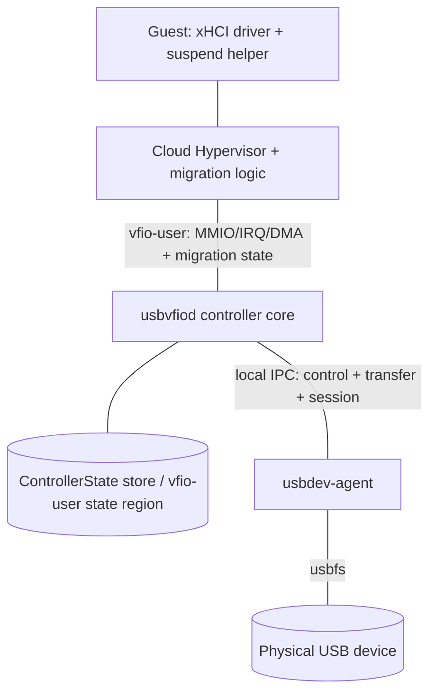
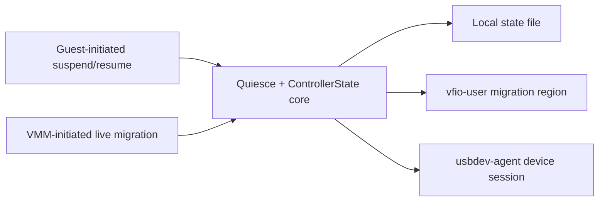

# usbvfiod Device State Preservation and Migration Work Plan (Suspend/Resume + Migration)

| Item | Value |
|---|---|
| Status | Merged plan (pending review) |
| Version | v2.1 (unified suspend/migration lifecycle) |
| Sources merged | Source A: same-host suspend/resume requirements (R1–R5, frozen in v1.0); Source B: `docs/ziyi-fu-discuss-for-da.md` (Ziyi Fu migration thesis proposal) |
| Scope | **Committed**: same-host suspend/resume, same-host snapshot/restore, **same-host live migration**, controller/agent restart; **feasibility study**: cross-host migration |
| Target components | `usbvfiod`, new `usbdev-agent`, guest helper/driver, Cloud Hypervisor / rust-vmm integration where needed |
| Related docs | `docs/developers/architecture.md`, `docs/users/systemd.md`, `docs/users/security.md`, `docs/ziyi-fu-discuss-for-da.md` |

---

## 0. Comparison of the Two Sources and Merge Conclusions

### 0.1 Positioning differences

| | Source A (plan v1.0) | Source B (thesis proposal) |
|---|---|---|
| Goal | Guest-initiated **suspend/resume** | VM-level **live migration** of external device state |
| Trigger | Guest OS / helper | VMM (Cloud Hypervisor) migration flow |
| Transport baseline | Local state file + agent rebinding | **vfio-user migration model** (protocol region + migration state machine) |
| Scenarios | Same host only | Same host + **cross-host feasibility study** |
| Deliverable | Engineering implementation | Thesis (RQs, related work, evaluation, 22-week timeline) |

Both share one core: **"where external-device state lives and how it is quiesced, saved, restored/rebuilt"**. They therefore merge into a single "device state preservation" plan with two front-ends over one state core.

### 0.2 Common items (merged)

| Merged item | In A | In B |
|---|---|---|
| State inventory and classification | §6.1 state classification | Design#2 Identify migration-relevant state |
| State format and save/restore | §6.2 `ControllerState` | Design#3 + "state format" |
| Quiesce and in-flight I/O | §5.5 in-flight policy | Design "quiescing", no lost/duplicated I/O |
| VMM integration | vfio-user region / agent / CH reconnect | CHV ↔ usbvfiod migration path via vfio-user |
| Guest transparency | R5 (CSC/PRC=0, no re-enumeration) | "without unnecessary disconnect/re-enumeration" |
| Evaluation | §11 tests and acceptance | Evaluation (correctness, continuity, limitations) |
| Physical device / host resource limits | R3 + non-serializable host state | "host-side USB access tied to local resources" |
| Same-host scenario | Only scenario | One evaluation item / feasibility fallback |

### 0.3 New items from Source B (adopted)

1. **VMM-initiated live migration**: migration lifecycle (iterative copy, downtime window, dirty convergence) rather than guest sleep.
2. **vfio-user migration protocol baseline**: device-state region, migration state machine and data-transfer semantics, plus **Cloud Hypervisor / rust-vmm integration** (upstream changes may be required).
3. **Cross-host migration feasibility study**: how the destination obtains an equivalent USB resource when the physical device cannot be copied, plus limits and alternatives.
4. **Migration failure/rollback**: the source host keeps running correctly after a failed migration.
5. **QEMU/KVM comparison**: as a more mature migration reference.
6. **Alternative exposure paths**: USB/IP and virtio-usb (related/future work).
7. **Academic deliverables**: research questions, related work, evaluation method, 22-week timeline.

### 0.4 Items retained from Source A

1. Guest-initiated **suspend/hibernate** path (standard PCI PM + paravirtual ABI + guest helper).
2. Long-lived **`usbdev-agent`**: device-session preservation; `usbvfiod` can restart/upgrade without losing the device.
3. **Hard transparency criteria**: CSC/PRC = 0, unsolicited HCRST = 0, no udev remove/add.
4. **S3/S4** scenarios and the host-side "no reset / no disconnect / no autosuspend" constraint.
5. Code-level gap analysis, **file-level change map**, dependency license constraints.

### 0.5 Unified model: suspend/resume and migration are not competing

Sources A and B describe **two triggers of the same quiesce/resume lifecycle**; they do not conflict in scope:

- **Guest-initiated suspend (S3/S4)**: the guest fully suspends, the controller preserves state, and execution continues after wake; the downtime window is long.
- **VMM-initiated live migration**: during pre-copy the guest keeps running; during stop-and-copy the vCPUs are paused (blackout), the last memory delta is synced quickly, and execution resumes on the destination. That "pause–sync–resume" is exactly the same quiesce/resume, just with a very short window.

Both therefore share one state core and one state machine; they differ only in **trigger, downtime-window length, and whether the physical device resource is reachable**. The only real trade-offs left are:

| Real trade-off | Resolution |
|---|---|
| State transport | Make the vfio-user migration region the main line; the local state file/agent serves guest suspend and as a fallback |
| Cross-host physical resource | Same-host is the committed deliverable; cross-host is a feasibility study (the physical device cannot be copied) |
| Timeline | Converge the thesis core on "controller state migration via vfio-user + same-host validation" |

> Technical nuance to add: **stock live migration does not notify the guest OS to suspend** — it only pauses the vCPUs. Gracefully draining in-flight physical-USB I/O and avoiding re-enumeration requires guest cooperation (a paravirtual notification or a standard-PM pre-quiesce). That capability is part of this plan, **not existing CH behavior**. See §4.0 for the unified lifecycle and §4.2 for the migration-phase mapping.

### 0.6 Merged scope and non-goals

- **In scope**: state inventory and format; quiesce; save/restore/reconnect; guest suspend/resume; VMM live migration (same host); `usbdev-agent`; migration failure/rollback; cross-host feasibility analysis; evaluation and thesis.
- **Non-goals (not committed for implementation this cycle)**: transparent cross-host migration of a physical device; implementing USB/IP or virtio-usb (analysis and future work only); non-Linux hosts; isochronous support (a separate track).

---

## 1. Merged Requirements

> Tags: [A] from the suspend/resume requirements; [B] from the migration thesis proposal; [A+B] shared.

### 1.1 State and semantics

| ID | Requirement | Source |
|---|---|---|
| MR1 | Complete the usbvfiod migration-relevant state inventory and classification (controller-private / guest-RAM / host-session / agent) and produce an inventory document | [A+B] |
| MR2 | Define a versioned, verifiable, forward-compatible state format (`schema_version` + `abi_version` + CRC) | [A+B] |
| MR3 | State can be fully saved, restored and reconnected; one state format serves both suspend and migration | [A+B] |
| MR4 | At boundaries, I/O is neither lost nor duplicated, with no unexpected disconnect/re-enumeration | [A+B] |
| MR5 | Support VMM migration lifecycle semantics (pre-copy / stop-and-copy, downtime window, convergence and dirty handling) | [B] |

### 1.2 Trigger and transport

| ID | Requirement | Source |
|---|---|---|
| MR6 | Guest-initiated suspend/resume: standard PCI PM plus a paravirtual ABI + guest helper | [A] |
| MR7 | VMM-initiated migration: implement and integrate the vfio-user migration model into Cloud Hypervisor (including rust-vmm changes if needed) | [B] |
| MR8 | Guest suspend and VMM migration reuse the same quiesce/resume lifecycle and state core (§4.0), with consistent semantics | [A+B] |

### 1.3 Device and host resources

| ID | Requirement | Source |
|---|---|---|
| MR9 | `usbdev-agent` preserves the device session: no reset, no disconnect, no autosuspend, claims retained | [A] |
| MR10 | `usbvfiod` can restart/upgrade independently without losing the device (kept alive by the agent) | [A] |
| MR11 | Analyze and design the usbvfiod ↔ Linux kernel / physical-device migration mechanism (additional work) | [B] |

### 1.4 Scenarios and boundaries

| ID | Requirement | Source |
|---|---|---|
| MR12 | Same host: S3/S4, CH snapshot/restore, controller/agent restart | [A] |
| MR13 | Same-host live migration | [B] |
| MR14 | Cross-host migration feasibility verdict; when infeasible, provide a limitation analysis and alternatives | [B] |
| MR15 | Migration failure/rollback: after failure the source host keeps running correctly and the guest is not corrupted | [B] |

### 1.5 Evaluation, deliverables and constraints

| ID | Requirement | Source |
|---|---|---|
| MR16 | Evaluation: state correctness, I/O continuity, downtime, compatibility, remaining limitations | [B] |
| MR17 | Reference/comparison: QEMU/KVM as reference; USB/IP and virtio-usb as future work | [B] |
| MR18 | Engineering and thesis documentation (including answers to the research questions) | [A+B] |
| MR19 | Only non-GPL/non-contagious dependencies, within the `deny.toml` allow-list | [A] |
| MR20 | Security and permissions: least privilege and integrity for the state file, agent and guest helper | [A] |

---

## 2. Goals and Acceptance / Evaluation Criteria

### 2.1 Functional acceptance

| Requirement | Acceptance criteria |
|---|---|
| MR6 Guest suspend/resume | Both the standard PM and paravirtual paths complete the handshake; failure can abort and retry |
| MR12 Same-host suspend/snapshot/restart | After resume, every register and internal state field is bit-identical; I/O continues |
| MR13 Same-host migration | After migration the guest keeps using the same virtual controller; no re-enumeration |
| MR3/MR4 State and I/O | `lsusb -v` identical before/after; no udev remove/add; **CSC/PRC = 0, unsolicited HCRST = 0**; no lost/duplicated I/O |
| MR15 Rollback | After a failed migration the source keeps running normally with a consistent guest |
| MR9/MR10 Device session | During suspension and `usbvfiod` restart the fd stays open, claims are retained, `power/control=on` |

### 2.2 Evaluation metrics (thesis)

1. **State correctness**: field-level save/restore comparison; guest-visible device tree and handles unchanged.
2. **I/O continuity**: block-device fio/checksum shows no loss and no duplication across the boundary.
3. **Downtime**: measured live-migration downtime and convergence behavior.
4. **Non-disruption**: CSC/PRC = 0, udev events = 0.
5. **Compatibility**: verified per class (USB storage / HID / serial).
6. **Limitations**: cross-host, non-copyable physical device, in-flight semantics, class differences.
7. **Migration-variant comparison**: guest-cooperative vs vCPU-pause only in terms of correctness, I/O continuity and downtime.

---

## 3. Target Architecture

### 3.1 Components



| Component | Responsibility |
|---|---|
| Controller core | xHCI emulation; quiesce; state import/export; paravirtual/PM registers |
| Migration adapter | Interact with CH through the vfio-user migration model (state region, migration state machine) |
| `usbdev-agent` | Own fd/claim/endpoint; keep the device session alive; forbid reset/autosuspend |
| Guest helper | Guest-initiated suspend handshake |
| CH/rust-vmm (may change) | Migration orchestration, state transport, device lifecycle |

### 3.2 Two front-ends, one core



### 3.3 Invariants

1. The agent is the sole owner of the physical device session.
2. No suspend/migration path may `reset`/`clear_halt`/reopen the device node.
3. No resume path may set PORTSC CSC/PRC/PSC.
4. One state format shared by both paths; a version mismatch must refuse to load and report an error.

---

## 4. Protocols

### 4.0 Unified quiesce/resume lifecycle

The three triggers map onto one state machine:

| Trigger | When quiesce begins | Downtime window | Guest perception |
|---|---|---|---|
| Guest system suspend (S3/S4) | Guest helper issues `PREPARE/ENTER`; the kernel then performs PCI D3 | Long (until wake) | Explicit suspend/wake |
| VMM migration (guest-cooperative) | VMM requests guest quiesce before stop-and-copy (see below), then pauses vCPUs | Short (blackout) | None (a time jump only) |
| VMM migration (vCPU-pause only) | Controller freezes at the vCPU pause | Short | None |

Unified state machine: `RUNNING → PREPARING → READY → SUSPENDED/FROZEN → RESUMING → RUNNING`, aligned with the vfio-user migration phases `PRE_COPY / STOP_COPY / STOP / RESUMING` (exact naming per the spec confirmed in Phase 0).

**Request channel for guest-cooperative migration**: the VMM tells usbvfiod via the vfio-user migration state that migration has started → usbvfiod sets a "host requests quiesce" bit in the paravirtual control block (Appendix A, `PV_HOST_REQ`) → the guest helper polls it, performs USB-level quiesce, and writes `PREPARE_SUSPEND`/`ENTER_SUSPEND` → usbvfiod becomes READY and reports it back to the VMM through the migration state → the VMM then pauses the vCPUs and completes stop-and-copy. In-flight I/O is thus drained before the blackout.

### 4.1 Guest-initiated suspend/resume ([A])

- Standard PCI PM: PM capability + PMCSR (D0/D3hot, PME), config-space write callbacks.
- Paravirtual: vendor xECP + BAR0 control block (Appendix A), `PREPARE/ENTER/ABORT/RESUME` state machine.
- Guest helper: `systemd-sleep` hook (pre/post); a non-zero exit aborts suspend.
- Details unchanged from v1.0 §5.1–§5.6.

### 4.2 VMM-initiated migration ([B], main line)

Using the vfio-user migration model as baseline:

1. **Capability negotiation**: the controller reports migration-capable regions and the migration state set to CH.
2. **Migration state machine** (aligned with the vfio-user spec / CH's existing framework): `RUNNING → PRE_COPY → STOP_COPY → STOP → RESUMING → RUNNING` (exact naming per the spec confirmed in Phase 0).
3. **Pre-copy**: the guest keeps running; the controller supports repeatable state snapshots (incremental or full, per vfio-user semantics).
4. **Stop-and-copy**: quiesce; drain in-flight I/O; export the final state; record dequeue pointers, etc.
5. **Destination restore**: load state; rebuild workers; rebind the device session (destination-side agent) or establish an equivalent resource; emit no port change events.
6. **Source cleanup / rollback**: release after success; on failure the source un-quiesces and keeps running (MR15).

> Unification with guest suspend: migration's **stop-and-copy** corresponds to `PREPARING → READY → SUSPENDED`, and destination `RESUMING → RUNNING` corresponds to wake. In the **guest-cooperative** variant, the VMM requests the guest to complete USB-level quiesce through the §4.0 channel before pausing the vCPUs, so in-flight I/O is drained before the blackout; in the **vCPU-pause only** variant, the controller freezes immediately at the vCPU pause and incomplete transactions are recovered on the destination.

> Key unknown (Phase 0): CH/rust-vmm's current vfio-user migration support boundary and whether upstream patches are needed. If unavailable, the same-host case falls back to "local state file + agent rebinding".

### 4.3 Quiesce and in-flight I/O policy ([A+B])

- Stop accepting new work; wait for in-flight URBs up to `DEADLINE_MS` (default 2000 ms).
- Unsubmitted TRBs stay on the ring and continue from the saved pointer after resume.
- On timeout or remaining queued work:
  - Guest path: `BUSY_RETRY`; the helper aborts and retries.
  - Migration path: extend the stop-and-copy downtime window (if the framework allows) or cancel URBs and let the guest retry; a failed migration rolls back.
- Cancellation **does not reset the device**; the semantics of partially applied OUT transfers must be documented.

### 4.4 Failure and rollback ([B])

- The source must **not** release the device session or state before receiving migration success confirmation.
- On failure: the source `RESUME`s, restores workers and the device session, and the guest keeps running; the reason is recorded and reported.
- On destination failure: clean up the loaded state without holding device resources.

### 4.5 Zero-perception guarantees ([A+B])

1. Freeze PORTSC/PORTPMSC and return their original values.
2. Do not modify slot/endpoint contexts or dequeue pointers.
3. Idempotently handle the registers the guest driver rewrites on resume.
4. Emit no Port Status Change Event.
5. After resume, re-validate guest RAM (DMA map rebuild) before releasing workers.
6. Guest prerequisite: avoid `XHCI_RESET_ON_RESUME` (Phase 0 determines the configuration or a custom driver).

---

## 5. State Model and Persistence

### 5.1 State classification (merges A §6.1)

| Class | Content | Handling |
|---|---|---|
| Controller-private | PCI config + MSI-X + PMCSR, USBCMD/USBSTS/CRCR/DCBAAP/CONFIG, PORTSC/PORTPMSC, IMAN/IMOD/ERSTSZ/ERSTBA/ERDP, EventRing producer state, CommandRing state, slot/endpoint worker state, in-flight TD | Serialized into `ControllerState` |
| In guest RAM | DCBAA, device/input contexts, transfer rings, ERST, event ring contents | Not saved twice; referenced by address and validated on restore |
| Host kernel/device | device configuration, endpoint toggles, device-internal state | **Not serializable**; preserved by the agent keeping fd/claim and never resetting |
| Agent session | session id, device identifier, claims, open endpoints | Retained agent-side across controller restarts |

### 5.2 State format and transport

- `ControllerState`: versioned + CRC + UUID + DMA segment digest (Appendix B).
- **Two transport channels**:
  1. **vfio-user migration region / device-state region** (migration main line, [B]);
  2. Local state file `/run/usbvfiod/<uuid>/state.bin` (guest suspend and fallback, [A]).
- Atomic write (temp→fsync→rename); permissions `0600`/directory `0700`; validate version and CRC on read.
- Forward compatibility: ignore unknown fields; refuse to load on version mismatch and report an error.

### 5.3 Cross-host state semantics ([B])

- **Guest RAM** migrates with the VM (CH's responsibility).
- **Controller-private state** travels through the vfio-user migration region.
- **Host device session** cannot travel → the destination needs an equivalent resource (see §6.3).

---

## 6. Device and Host Resources: Same Host vs Cross Host

### 6.1 `usbdev-agent` ([A], also reused for migration)

- Owns fd/claim/endpoint; no autosuspend; never resets.
- Decoupled from the controller via local IPC (`AgentRealDevice` proxying the existing `RealDevice` trait).
- On controller restart, rebinds by `session_id`.

### 6.2 Same host

- Suspend/snapshot/migration all keep the same agent session; source = destination.
- `usbvfiod` may restart while the agent keeps the device alive.

### 6.3 Cross-host feasibility analysis ([B], MR14/MR11)

The physical device cannot be copied, so the destination must obtain an equivalent USB resource. Candidate mechanisms:

| Mechanism | Idea | Cost/limits |
|---|---|---|
| Destination-local same-model device | Destination agent opens a local device and software state is migrated | Not migrating the device; internal state (toggles/config) must be rebuilt; suits storage-like classes |
| USB/IP | Device stays on the source, exported over USB/IP, attached via the destination `vhci-hcd` | Source must stay online; network latency/bandwidth; complex to combine with the xHCI model |
| virtio-usb (future work) | Reuse USB/IP + vhci-hcd, replacing the TCP transport with VirtIO | Upstream is largely stubbed; early stage |
| Not supported | Hot-unplug before migration, hot-plug after | The guest sees disconnect/re-enumeration, violating MR4 |

**Verdict factors**: device-internal state is non-copyable; class differences (storage can restore logical state via remount, HID/realtime devices are worse); in-flight I/O cannot be continued across hosts. Phase 5 produces the explicit verdict (answers thesis RQ4).

---

## 7. Work Breakdown

### Phase 0 — Research, behavior validation and design freeze (thesis Weeks 1–4)
- T0.1 [B] Analyze the vfio-user migration spec, the QEMU implementation and relevant CH/rust-vmm draft PRs.
- T0.2 [A+B] Establish CH's vfio-user migration support boundary and the changes required.
- T0.3 [A] Measure the stock guest's xhci register/command sequence across S3/S4 and whether it re-enumerates.
- T0.4 [A+B] State inventory (MR1) and requirements confirmation.
- T0.5 [B] Same-host/cross-host pre-feasibility analysis and physical-resource model.
- T0.6 [A+B] Freeze paravirtual ABI v1 and `ControllerState` schema v1.
- **Exit**: support map, state inventory, requirements/scope, go/no-go, thesis draft started.

### Phase 1 — State core: quiesce + serialization + zero-perception (Weeks 5–10)
- T1.1 [A+B] `ControllerState` + serialization + version/CRC.
- T1.2 [A+B] `SuspendCoordinator`/quiesce broadcast + in-flight I/O policy.
- T1.3 [A+B] Port/context freeze + zero-perception guarantees.
- T1.4 [A+B] Multi-worker snapshot consistency barrier.
- T1.5 [A+B] Unit tests.
- **Exit**: correct state round-trip; quiesce verifiable at unit level.

### Phase 2 — Guest-initiated path ([A], Weeks 5–10 design / 11–14 implementation)
- T2.1 PCI PM capability + config-space write callbacks.
- T2.2 Vendor xECP + control-block ABI.
- T2.3 Reference guest helper (`systemd-sleep` hook).
- T2.4 S3/S4 integration tests (including busy → retry).
- **Exit**: deterministic guest suspend/resume.

### Phase 3 — VMM migration path ([B], Weeks 5–10 design / 11–14 implementation, main line)
- T3.1 usbvfiod-side vfio-user migration/device-state region.
- T3.2 CH / rust-vmm integration (capability negotiation, state transport, lifecycle).
- T3.3 Migration state machine (pre-copy / stop-and-copy / downtime).
- T3.4 Failure and rollback (MR15).
- T3.5 Same-host live migration prototype.
- **Exit**: after same-host migration the guest keeps using the device with no re-enumeration.

### Phase 4 — Device session and physical resources ([A+B], Weeks 11–18)
- T4.1 `usbdev-agent` split + IPC + `AgentRealDevice`.
- T4.2 Verify independent `usbvfiod` restart/upgrade.
- T4.3 Physical-device handling: same-host rebind; cross-host candidate experiments.
- T4.4 Cross-host feasibility experiments and verdict.
- **Exit**: kill/restart `usbvfiod` with no disconnect; cross-host verdict written up.

### Phase 5 — Evaluation and comparison ([B], Weeks 15–18)
- T5.1 Functional/correctness/continuity/downtime evaluation (MR16).
- T5.2 Failure and boundary tests (rollback, agent crash, device unplug).
- T5.3 QEMU/KVM comparison (MR17).
- T5.4 Cross-host limits and alternatives verdict.
- **Exit**: evaluation report.

### Phase 6 — Hardening, documentation and thesis (Weeks 19–22)
- T6.1 Fault injection and security review (MR20).
- T6.2 User/developer/operations documentation.
- T6.3 Thesis writing and defense preparation (MR18).
- **Exit**: acceptance matrix green; thesis finalized.

---

## 8. Timeline (Engineering + Thesis Mapping)

| Thesis week | Phase | Main deliverables |
|---|---|---|
| 1–4 | Phase 0 | Support map, state inventory, requirements and scope, draft started |
| 5–10 | Phase 1 + Phase 2/3 design | State core; suspend and migration designs; migration lifecycle |
| 11–14 | Phase 2/3 implementation | Guest suspend path + usbvfiod migration + CH/rust-vmm integration prototype |
| 15–18 | Phase 4/5 | Continuity/downtime/rollback/limitation evaluation; cross-host verdict; extensions |
| 19–22 | Phase 6 | Documentation, thesis, defense |

> The full engineering version (complete agent split, cross-host mechanism exploration) may exceed 22 weeks; the thesis core is best converged on "controller state migration via vfio-user + same-host validation", with physical device/cross-host as an analysis chapter and future work.

---

## 9. File-Level Change Map

| File/component | Change | Source |
|---|---|---|
| `src/device/pci/{constants,config_space,register_set,xhci}.rs` | PM capability/PMCSR, write callbacks, suspend/resume hooks | [A] |
| New `src/device/xhci/suspend.rs` | SuspendCoordinator, state machine, quiesce | [A+B] |
| `src/device/xhci/{command_ring,slot_manager,interrupter,port,endpoint}.rs` | Freeze/unfreeze, state import/export | [A+B] |
| New `src/state.rs` | `ControllerState`, serialization, version/CRC | [A+B] |
| `src/xhci_backend.rs` | vfio-user migration/device-state region, `reset`/`dma_unmap`, DMA validation | [A+B] |
| New `src/migration/` | Migration state machine, CH interaction adapter | [B] |
| Cloud Hypervisor / rust-vmm | Submit patches if upstream lacks migration support (Phase 0 decision) | [B] |
| New `src/agent/` (or separate crate) | usbdev-agent, IPC, `AgentRealDevice` | [A+B] |
| New `src/device/xhci/paravirt.rs` | Vendor xECP and control block | [A] |
| `src/main.rs`, `src/cli.rs` | State file, agent socket, migration options | [A+B] |
| `Cargo.toml` | `serde` + binary format + CRC, etc. | [A+B] |
| `nix/checks/*` | Suspend/resume, snapshot, migration, reconnect, rollback tests | [A+B] |
| `docs/` | Design, evaluation and thesis-related documents | [A+B] |

---

## 10. Test and Evaluation Plan

| Level | Content |
|---|---|
| Unit | `ControllerState` round-trip, ABI parsing, PMCSR semantics, freeze state machine, migration state machine, zero-event guarantee |
| Integration (NixOS + CH) | s2idle/deep S3, S4 hibernate, CH snapshot/restore, **same-host live migration**, controller restart, agent restart |
| Scenario matrix | See Appendix C |
| Fault injection | In-flight timeout, agent crash, device unplug, corrupted state, migration failure rollback, helper abort |
| Evaluation | State correctness, no lost/duplicated I/O, downtime, compatibility, cross-host limits (MR16) |

---

## 11. Dependencies and Licenses

`deny.toml` allows `MIT`, `Apache-2.0`, `Unicode-3.0`, `BSD-3-Clause`. New dependencies must fall within that list and be non-GPL/non-contagious:

| Purpose | Candidate | License |
|---|---|---|
| State serialization | `serde` + `bincode`/`postcard`/`ciborium` | MIT / MIT+Apache-2.0 |
| Checksums | `crc32fast` | MIT+Apache-2.0 |
| sysfs/permissions | `nix` (optional) | MIT |
| systemd notification | `sd-notify` (optional) | MIT |
| IPC/SCM_RIGHTS | existing `tokio` + `vmm-sys-util` | MIT / BSD-3-Clause |
| Shared memory | existing `memmap2` | MIT+Apache-2.0 |

**Excluded**: `libusb` (LGPL) and any GPL/AGPL. The USB backend remains the pure-Rust `nusb`.

---

## 12. Risks and Mitigations

| Risk | Level | Mitigation | Source |
|---|---|---|---|
| CH/rust-vmm lacks vfio-user migration support | High | Decide in Phase 0; submit upstream patches if needed; same-host fallback to a local state file | [B] |
| Stock guest resets/re-enumerates on resume | High | Measure in Phase 0; paravirtual + custom guest configuration/driver | [A] |
| Cross-host physical device cannot migrate | High | Explicitly scoped as a feasibility study; provide alternatives and a limitation verdict | [B] |
| Failed migration corrupts the guest | Medium | Delay source release + rollback path (MR15) | [B] |
| Agent crash loses the device | Medium | Watchdog, minimal dependencies, fast restart; report residual risk | [A] |
| Inconsistent multi-worker snapshot | Medium | Global quiesce barrier + CRC | [A+B] |
| IPC data-plane performance | Medium | memfd/shared memory, batched submission, benchmark gate | [A] |
| State file leakage/tampering | Medium | tmpfs, `0600`/`0700`, CRC/version | [A] |
| Device unplugged during suspend/migration | Medium | Declare unsatisfiable; run detach and report | [A+B] |
| New dependency crossing license red lines | Low | Allow-list + `cargo-deny` | [A] |

---

## Appendix A: Paravirtual ABI v1 ([A])

**Vendor xECP** (tail of the BAR0 extended-capability chain): DW0 `CAP_ID|NEXT<<8`; DW1 `ABI_VERSION|CTRL_OFF_DW<<16`; DW2 `FEATURES`; DW3 reserved.

**Control-block registers** (BAR0 + `CTRL_OFF_DW*4`, proposed `0x1000`):

| Offset | Register | Access | Description |
|---|---|---|---|
| 0x00 | `PV_MAGIC` | RO | Presence check |
| 0x04 | `PV_ABI_VERSION` | RO | ABI version |
| 0x08 | `PV_CMD` | RW | Command |
| 0x0C | `PV_STATUS` | RO | State |
| 0x10 | `PV_ACK` | RW1C | Ack/event bit |
| 0x14 | `PV_COOKIE` | RW | Handshake token |
| 0x18 | `PV_DEADLINE_MS` | RW | Maximum drain time |
| 0x1C | `PV_ERR_DETAIL` | RO | Error detail |
| 0x20 | `PV_HOST_REQ` | RO | Host/VMM quiesce-request flag (set by usbvfiod, polled by the guest helper; see §4.0) |

Commands: `PREPARE_SUSPEND=1`, `ENTER_SUSPEND=2`, `ABORT_SUSPEND=3`, `RESUME=4`, `QUERY=5`.
States: `RUNNING=0`, `PREPARING=1`, `READY=2`, `SUSPENDED=3`, `BUSY_RETRY=4`, `ERROR=5`.
Errors: `NONE=0`, `INFLIGHT_TIMEOUT=1`, `QUEUED_WORK=2`, `DEVICE_FAULT=3`, `INTERNAL=4`.

---

## Appendix B: `ControllerState` Draft Fields ([A+B])

```
header: schema_version, abi_version, controller_uuid, payload_len, crc32
pci:    config_space[256], msix_table, msix_pba, pmcsr
xhci_operational: usbcmd, usbsts_shadow, crcr, dcbaap, config, pagesize
ports:  [ {portsc, portpmsc, usb_version, attached_device_id} ; 8 ]
runtime:[ {iman, imod, erstsz, erstba, erdp} ]
event_ring: {enqueue_pointer, trb_count, erst_count, cycle_state}
command_ring: {running, worker_state, dequeue_pointer, cycle_state}
slots:  [ {slot_id, slot_state, dcbaae,
           endpoints:[ {endpoint_id, ep_type, context_addr, ep_state,
                        dequeue_pointer, cycle_state, worker_state,
                        in_flight:[ {td_addr, submitted_bytes} ]} ]} ]
agent_session: {session_id, device_identifier, claimed_interfaces,
                open_endpoints:[{endpoint_id, direction, type}], speed}
dma_segments: [ {iova, size, kind} ]
migration: {state, generation, dirty_or_iteration_hint}   # [B]
```

---

## Appendix C: Scenario Matrix ([A+B])

| Scenario | VMM | Controller | Agent | Expectation |
|---|---|---|---|---|
| S3 (s2idle/deep) | running | running | running | Zero-perception, I/O continues |
| S4 hibernate | saves and exits | restart + restore | running (device never drops) | Zero-perception, I/O continues |
| CH snapshot/restore (same host) | save→exit→restore | restart + restore | running | Zero-perception, I/O continues |
| Same-host live migration | source→destination | source export / destination rebuild | running (same session) | No re-enumeration, continuous I/O |
| Controller restart/upgrade | running | restarts | running | No disconnect, I/O continues |
| Agent restart | any | any | restarts | One explicit error allowed; report and retry |
| Migration failure rollback | source continues | source `RESUME` | running | Source guest unaffected |
| In-flight transfer across the boundary | — | — | — | Prefer completion; otherwise `BUSY_RETRY` or report an error and retry |
| Cross-host migration | source→destination | state transportable | destination needs an equivalent resource | **Feasibility study**: reachability and limitation verdict |
| Device unplugged mid-process | — | — | — | Zero-perception unsatisfiable; detach + explicit report |
