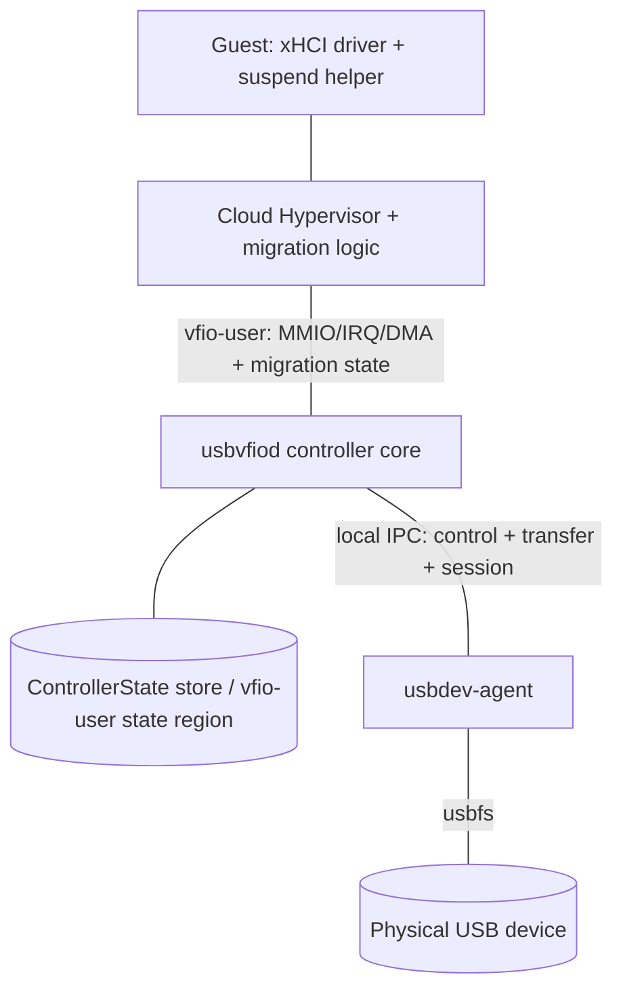
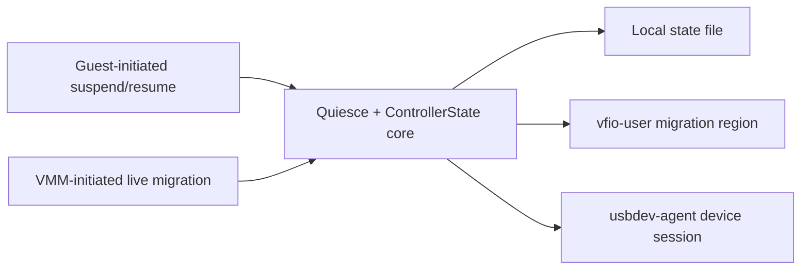

# usbvfiod Device State Preservation and Live Migration Work Plan

| Item | Value |
|---|---|
| Status | Final plan (pending review) |
| Version | v1.0 |
| Scope | Same-host suspend/resume, same-host snapshot/restore, same-host live migration, controller/agent restart; cross-host migration as a feasibility study |
| Target components | `usbvfiod`, `usbdev-agent`, guest helper/driver, Cloud Hypervisor / rust-vmm integration where needed |
| Related docs | `docs/developers/architecture.md`, `docs/users/systemd.md`, `docs/users/security.md` |

---

## 1. Scope and Goals

This plan establishes complete **device state preservation and migration** for `usbvfiod`, so that a guest using usbvfiod for USB passthrough can:

1. Fully suspend and wake the controller.
2. Have the controller quiesce on suspend/migration preparation (actively or on request) and be answered correctly.
3. Keep the host-side USB device connection and context throughout (no disconnect, no reset, no autosuspend).
4. Wake/restore in place or at a new location and rebind to the host-side device session.
5. Perceive no disconnect, no re-enumeration, unchanged context, and be able to continue the operations it was performing before suspend/migration.

**In scope**: state inventory and format; quiesce; save/restore/reconnect; guest suspend/resume; VMM live migration; `usbdev-agent`; migration failure/rollback; cross-host feasibility analysis; evaluation and documentation.

**Non-goals (not committed for implementation this cycle)**: transparent cross-host migration of a physical device; implementing USB/IP or virtio-usb (analysis and future work only); non-Linux hosts; isochronous support (a separate track).

---

## 2. Terminology

- **Controller**: the xHCI emulation inside `usbvfiod`; can be stopped and rebuilt.
- **Agent (`usbdev-agent`)**: long-lived process owning the USB fd, interface claims and endpoints; never resets and never autosuspends.
- **Quiesce**: stop accepting new work and drain in-flight transfers, **without** destroying endpoints or releasing the device.
- **Zero-perception**: the guest observes no device change (no disconnect, no reset, no re-enumeration).
- **guest-cooperative migration**: a migration variant in which the VMM requests the guest to complete USB-level quiesce before pausing the vCPUs.
- **vCPU-pause only migration**: a migration variant in which the VMM only pauses the vCPUs and the controller freezes at the pause instant.

---

## 3. Final Requirements

### 3.1 State and semantics

| ID | Requirement |
|---|---|
| R1 | Complete the migration-relevant state inventory and classification (controller-private / guest-RAM / host-session / agent) and produce an inventory document |
| R2 | Define a versioned, verifiable, forward-compatible state format (`schema_version` + `abi_version` + CRC) |
| R3 | State can be fully saved, restored and reconnected; one state format serves both suspend and migration |
| R4 | At boundaries, I/O is neither lost nor duplicated, with no unexpected disconnect/re-enumeration |
| R5 | Support VMM migration lifecycle semantics (pre-copy / stop-and-copy, downtime window, convergence and dirty handling) |

### 3.2 Trigger and transport

| ID | Requirement |
|---|---|
| R6 | Guest-initiated suspend/resume: standard PCI PM plus a paravirtual ABI + guest helper |
| R7 | VMM-initiated migration: implement and integrate the vfio-user migration model into Cloud Hypervisor (including rust-vmm changes if needed) |
| R8 | Guest suspend and VMM migration reuse the same quiesce/resume lifecycle and state core, with consistent semantics |
| R9 | Support both guest-cooperative and vCPU-pause only migration variants, with explicit applicability conditions |

### 3.3 Device and host resources

| ID | Requirement |
|---|---|
| R10 | `usbdev-agent` preserves the device session: no reset, no disconnect, no autosuspend, interface claims retained |
| R11 | `usbvfiod` can restart/upgrade independently without losing the device (kept alive by the agent and rebound) |
| R12 | Analyze and design the usbvfiod ↔ Linux kernel / physical-device migration mechanism |

### 3.4 Scenarios and boundaries

| ID | Requirement |
|---|---|
| R13 | Same host: S3/S4, CH snapshot/restore, controller/agent restart |
| R14 | Same-host live migration |
| R15 | Cross-host migration feasibility verdict; when infeasible, provide a limitation analysis and alternatives |
| R16 | Migration failure/rollback: after failure the source host keeps running correctly and the guest is not corrupted |

### 3.5 Evaluation, deliverables and constraints

| ID | Requirement |
|---|---|
| R17 | Evaluation: state correctness, I/O continuity, downtime, compatibility, remaining limitations |
| R18 | Reference/comparison: QEMU/KVM as reference; USB/IP and virtio-usb as future work |
| R19 | Documentation deliverables: design, user, operations and evaluation report |
| R20 | Engineering constraints: non-GPL/non-contagious dependencies only (`deny.toml` allow-list); least privilege and integrity for the state file, agent and guest helper |

---

## 4. Acceptance and Evaluation Criteria

### 4.1 Functional acceptance

| Requirement | Acceptance criteria |
|---|---|
| R6 Guest suspend/resume | Both the standard PM and paravirtual paths complete the handshake; failure can abort and retry |
| R13 Same-host suspend/snapshot/restart | After resume, every register and internal state field is bit-identical; I/O continues |
| R14 Same-host migration | After migration the guest keeps using the same virtual controller; no re-enumeration |
| R3/R4 State and I/O | `lsusb -v` identical before/after; no udev remove/add; **CSC/PRC = 0, unsolicited HCRST = 0**; no lost/duplicated I/O |
| R16 Rollback | After a failed migration the source keeps running normally with a consistent guest |
| R10/R11 Device session | During suspension and `usbvfiod` restart the fd stays open, claims are retained, `power/control=on` |

### 4.2 Evaluation metrics

1. **State correctness**: field-level save/restore comparison; guest-visible device tree and handles unchanged.
2. **I/O continuity**: block-device fio/checksum shows no loss and no duplication across the boundary.
3. **Downtime**: measured live-migration downtime and convergence behavior.
4. **Non-disruption**: CSC/PRC = 0, udev events = 0.
5. **Compatibility**: verified per class (USB storage / HID / serial).
6. **Migration-variant comparison**: guest-cooperative vs vCPU-pause only in correctness, I/O continuity and downtime.
7. **Limitations**: cross-host, non-copyable physical device, in-flight semantics, class differences.

---

## 5. Target Architecture

### 5.1 Components



| Component | Responsibility |
|---|---|
| Controller core | xHCI emulation; quiesce; state import/export; paravirtual/PM registers |
| Migration adapter | Interact with CH through the vfio-user migration model (state region, migration state machine) |
| `usbdev-agent` | Own fd/claim/endpoint; keep the device session alive; forbid reset/autosuspend |
| Guest helper | Guest-initiated suspend handshake and guest-cooperative migration response |
| CH/rust-vmm (may change) | Migration orchestration, state transport, device lifecycle |

### 5.2 One core, two trigger classes



### 5.3 Invariants

1. The agent is the sole owner of the physical device session.
2. No suspend/migration path may `reset`/`clear_halt`/reopen the device node.
3. No resume path may set PORTSC CSC/PRC/PSC.
4. One state format shared by both paths; a version mismatch must refuse to load and report an error.

---

## 6. Protocols

### 6.0 Unified quiesce/resume lifecycle

The three triggers map onto one state machine:

| Trigger | When quiesce begins | Downtime window | Guest perception |
|---|---|---|---|
| Guest system suspend (S3/S4) | Guest helper issues `PREPARE/ENTER`; the kernel then performs PCI D3 | Long (until wake) | Explicit suspend/wake |
| VMM migration (guest-cooperative) | VMM requests guest quiesce before stop-and-copy, then pauses vCPUs | Short (blackout) | None (a time jump only) |
| VMM migration (vCPU-pause only) | Controller freezes at the vCPU pause | Short | None |

Unified state machine: `RUNNING → PREPARING → READY → SUSPENDED/FROZEN → RESUMING → RUNNING`, aligned with the vfio-user migration phases `PRE_COPY / STOP_COPY / STOP / RESUMING` (exact naming per the spec and CH implementation).

**Request channel for guest-cooperative migration**: the VMM tells usbvfiod via the vfio-user migration state that migration has started → usbvfiod sets a "host requests quiesce" bit in the paravirtual control block (Appendix A, `PV_HOST_REQ`) → the guest helper polls it, performs USB-level quiesce, and writes `PREPARE_SUSPEND`/`ENTER_SUSPEND` → usbvfiod becomes READY and reports it back to the VMM through the migration state → the VMM then pauses the vCPUs and completes stop-and-copy. In-flight I/O is thus drained before the blackout.

> Note: standard live migration only pauses the vCPUs and does **not** notify the guest OS to suspend. Gracefully draining in-flight physical-USB I/O and avoiding re-enumeration requires guest cooperation (a paravirtual notification or a standard-PM pre-quiesce); that capability is part of this plan.

### 6.1 Standard PCI PM path

1. Add a PM Capability (cap id `0x01`) + PMCSR supporting D0/D3hot and PME.
2. Add **write callbacks (side effects)** to `ConfigSpace`/`RegisterSet` to intercept PMCSR writes.
3. On D3hot: if not already SUSPENDED, best-effort quiesce (bounded drain), then mark SUSPENDED; always accept the D3 write.
4. On D0: resume, **emitting no port change events at all**.
5. Treat the guest driver's register sequence during suspend/resume **idempotently**: keep slots/contexts/rings, and do not clear existing slots when the driver rewrites registers.

### 6.2 Paravirtual path

- Append a **vendor-defined xECP** to the xHCI extended-capability chain; a field gives the BAR0-relative offset of a dedicated control block (proposed `0x1000`, currently unused).
- The guest helper maps BAR0 via `/sys/bus/pci/devices/<bdf>/resource0` and locates the control block (requires root/CAP_SYS_RAWIO).
- The control block exposes `MAGIC`, `ABI_VERSION`, `CMD`, `STATUS`, `ACK` (RW1C), `COOKIE`, `DEADLINE_MS`, `ERR_DETAIL`, `HOST_REQ`; see Appendix A.
- The guest helper implements the handshake as a `systemd-sleep` hook (pre/post); a non-zero exit aborts suspend.

### 6.3 VMM-initiated migration

Using the vfio-user migration model as baseline:

1. **Capability negotiation**: the controller reports migration-capable regions and the migration state set to CH.
2. **Migration state machine** (aligned with the vfio-user spec / CH's framework): `RUNNING → PRE_COPY → STOP_COPY → STOP → RESUMING → RUNNING`.
3. **Pre-copy**: the guest keeps running; the controller supports repeatable state snapshots (incremental or full, per vfio-user semantics).
4. **Stop-and-copy**: quiesce; drain in-flight I/O; export the final state; record dequeue pointers, etc.
5. **Destination restore**: load state; rebuild workers; rebind the device session (destination-side agent) or establish an equivalent resource; emit no port change events.
6. **Source cleanup / rollback**: release after success; on failure the source un-quiesces and keeps running (R16).

**Mapping to the unified lifecycle**: stop-and-copy corresponds to `PREPARING → READY → SUSPENDED`, and destination `RESUMING → RUNNING` corresponds to wake. The guest-cooperative variant completes USB-level quiesce before the vCPU pause; the vCPU-pause only variant freezes at the pause instant and recovers incomplete transactions on the destination.

> Key unknown: CH/rust-vmm's current vfio-user migration support boundary and whether upstream patches are needed. If unavailable, the same-host case falls back to "local state file + agent rebinding".

### 6.4 Quiesce and in-flight I/O policy

- Stop accepting new doorbells/TRBs; wait for in-flight URBs up to `DEADLINE_MS` (default 2000 ms).
- Unsubmitted TRBs stay on the ring and continue from the saved dequeue pointer/cycle after resume.
- On timeout or remaining queued work:
  - Guest path: return `BUSY_RETRY`; the helper aborts and retries.
  - Migration path: extend the stop-and-copy downtime window (if the framework allows) or cancel URBs and let the guest retry; a failed migration rolls back.
- Cancellation **does not reset the device**; the semantics of partially applied OUT transfers must be documented, and retries require idempotency at the upper protocol layer.

### 6.5 Failure and rollback

- The source must **not** release the device session or state before receiving migration success confirmation.
- On failure: the source `RESUME`s, restores workers and the device session, and the guest keeps running; the reason is recorded and reported.
- On destination failure: clean up the loaded state without holding device resources.

### 6.6 Zero-perception guarantees

1. Freeze PORTSC/PORTPMSC and return their original values; never set change bits.
2. Do not modify slot/endpoint contexts or any dequeue pointer (guest RAM stays as-is).
3. Handle the registers the guest driver rewrites on resume (USBCMD/CRCR/DCBAAP/ERSTBA/ERDP) idempotently.
4. Emit no Port Status Change Event due to suspend/resume/migration.
5. After resume, re-validate guest RAM mappings (DMA map rebuild) before releasing workers.
6. Guest prerequisite: avoid `XHCI_RESET_ON_RESUME` behavior (use s2idle, a custom configuration or a custom driver).

---

## 7. State Model and Persistence

### 7.1 State classification

| Class | Content | Handling |
|---|---|---|
| Controller-private | PCI config + MSI-X + PMCSR, USBCMD/USBSTS/CRCR/DCBAAP/CONFIG, PORTSC/PORTPMSC, IMAN/IMOD/ERSTSZ/ERSTBA/ERDP, EventRing producer state, CommandRing state, slot/endpoint worker state, in-flight TD | Serialized into `ControllerState` |
| In guest RAM | DCBAA, device/input contexts, transfer rings, ERST, event ring contents | Not saved twice; referenced by address and validated on restore |
| Host kernel/device | device configuration, endpoint toggles, device-internal state | **Not serializable**; preserved by the agent keeping fd/claim and never resetting |
| Agent session | session id, device identifier, claims, open endpoints | Retained agent-side across controller restarts |

### 7.2 State format and transport

- `ControllerState`: versioned + CRC + UUID + DMA segment digest (Appendix B).
- **Two transport channels**:
  1. **vfio-user migration region / device-state region** (migration main line);
  2. Local state file `/run/usbvfiod/<uuid>/state.bin` (guest suspend and fallback).
- Atomic write (temp→fsync→rename); permissions `0600`/directory `0700`; validate version and CRC on read.
- Forward compatibility: ignore unknown fields; refuse to load on version mismatch and report an error.

### 7.3 Cross-host state semantics

- **Guest RAM** migrates with the VM (the VMM's responsibility).
- **Controller-private state** travels through the vfio-user migration region.
- **Host device session** cannot travel → the destination needs an equivalent resource (see §8.3).

---

## 8. Device and Host Resources

### 8.1 `usbdev-agent`

- Owns fd/claim/endpoint; submits no new URBs during suspension; no autosuspend (`power/control=on`); never resets.
- Decoupled from the controller via local IPC: `AgentRealDevice` proxies the existing `RealDevice` trait, leaving the controller core logic essentially unchanged; the `nusb` backend moves into the agent while the in-process backend is retained for tests.
- IPC: Unix domain socket, length-prefixed binary frames, requests/responses carrying `request_id`; completions delivered as asynchronous events; large transfers use memfd/`SCM_RIGHTS` or a shared-memory ring.
- On controller restart, rebinds by `session_id`.

### 8.2 Same host

- Suspend/snapshot/migration all keep the same agent session; source = destination.
- `usbvfiod` may restart while the agent keeps the device alive.

### 8.3 Cross-host feasibility analysis

The physical device cannot be copied, so the destination must obtain an equivalent USB resource. Candidate mechanisms:

| Mechanism | Idea | Cost/limits |
|---|---|---|
| Destination-local same-model device | Destination agent opens a local device and software state is migrated | Not migrating the device; internal state must be rebuilt; suits storage-like classes |
| USB/IP | Device stays on the source, exported over USB/IP, attached via the destination `vhci-hcd` | Source must stay online; network latency/bandwidth; complex to combine with the xHCI model |
| virtio-usb (future work) | Reuse USB/IP + vhci-hcd, replacing the TCP transport with VirtIO | Upstream is largely stubbed; early stage |
| Not supported | Hot-unplug before migration, hot-plug after | The guest sees disconnect/re-enumeration, violating R4 |

**Verdict factors**: device-internal state is non-copyable; class differences (storage can restore logical state via remount, HID/realtime devices are worse); in-flight I/O cannot be continued across hosts. Phase 5 produces the explicit verdict.

---

## 9. Work Breakdown

### Phase 0 — Research, behavior validation and design freeze (4 weeks)
- T0.1 Analyze the vfio-user migration spec, the QEMU implementation and relevant CH/rust-vmm draft PRs.
- T0.2 Establish CH's vfio-user migration support boundary and the changes required.
- T0.3 Measure the stock guest's xhci register/command sequence across S3/S4 and whether it re-enumerates.
- T0.4 State inventory (R1) and requirements confirmation.
- T0.5 Same-host/cross-host pre-feasibility analysis and physical-resource model.
- T0.6 Freeze paravirtual ABI v1 and `ControllerState` schema v1.
- **Exit**: support map, state inventory, requirements/scope, go/no-go.

### Phase 1 — State core: quiesce + serialization + zero-perception (6 weeks)
- T1.1 `ControllerState` + serialization + version/CRC.
- T1.2 `SuspendCoordinator`/quiesce broadcast + in-flight I/O policy.
- T1.3 Port/context freeze + zero-perception guarantees.
- T1.4 Multi-worker snapshot consistency barrier.
- T1.5 Unit tests.
- **Exit**: correct state round-trip; quiesce verifiable at unit level.

### Phase 2 — Guest-initiated path (design + implementation)
- T2.1 PCI PM capability + config-space write callbacks.
- T2.2 Vendor xECP + control-block ABI.
- T2.3 Reference guest helper (`systemd-sleep` hook).
- T2.4 S3/S4 integration tests (including busy → retry).
- **Exit**: deterministic guest suspend/resume.

### Phase 3 — VMM migration path (main line, design + implementation)
- T3.1 usbvfiod-side vfio-user migration/device-state region.
- T3.2 CH / rust-vmm integration (capability negotiation, state transport, lifecycle).
- T3.3 Migration state machine (pre-copy / stop-and-copy / downtime) and the two variants.
- T3.4 Failure and rollback (R16).
- T3.5 Same-host live migration prototype.
- **Exit**: after same-host migration the guest keeps using the device with no re-enumeration.

### Phase 4 — Device session and physical resources
- T4.1 `usbdev-agent` split + IPC + `AgentRealDevice`.
- T4.2 Verify independent `usbvfiod` restart/upgrade.
- T4.3 Physical-device handling: same-host rebind; cross-host candidate experiments.
- T4.4 Cross-host feasibility experiments and verdict.
- **Exit**: kill/restart `usbvfiod` with no disconnect; cross-host verdict written up.

### Phase 5 — Evaluation and comparison
- T5.1 Functional/correctness/continuity/downtime evaluation (R17).
- T5.2 Failure and boundary tests (rollback, agent crash, device unplug).
- T5.3 QEMU/KVM comparison (R18).
- T5.4 Cross-host limits and alternatives verdict.
- **Exit**: evaluation report.

### Phase 6 — Hardening, documentation and delivery
- T6.1 Fault injection and security review (R20).
- T6.2 User/developer/operations documentation and the evaluation report (R19).
- **Exit**: acceptance matrix green; documentation finalized.

---

## 10. Timeline and Milestones

| Period | Phase | Main deliverables |
|---|---|---|
| Weeks 1–4 | Phase 0 | Support map, state inventory, requirements and scope, go/no-go |
| Weeks 5–10 | Phase 1 + Phase 2/3 design | State core; suspend and migration designs; migration lifecycle |
| Weeks 11–14 | Phase 2/3 implementation | Guest suspend path + usbvfiod migration + CH/rust-vmm integration prototype |
| Weeks 15–18 | Phase 4/5 | Continuity/downtime/rollback/limitation evaluation; cross-host verdict |
| Weeks 19–22 | Phase 6 | Hardening, documentation and delivery |

**Milestones**:
- M1 (week 4): support map and design freeze.
- M2 (week 10): state core usable; design review passed.
- M3 (week 14): same-host suspend and migration prototypes runnable.
- M4 (week 18): evaluation report and cross-host verdict.
- M5 (week 22): documentation and deliverables finalized.

---

## 11. File-Level Change Map

| File/component | Change |
|---|---|
| `src/device/pci/{constants,config_space,register_set,xhci}.rs` | PM capability/PMCSR, write callbacks, suspend/resume hooks |
| New `src/device/xhci/suspend.rs` | SuspendCoordinator, state machine, quiesce |
| `src/device/xhci/{command_ring,slot_manager,interrupter,port,endpoint}.rs` | Freeze/unfreeze, state import/export |
| New `src/state.rs` | `ControllerState`, serialization, version/CRC |
| `src/xhci_backend.rs` | vfio-user migration/device-state region, `reset`/`dma_unmap`, DMA validation |
| New `src/migration/` | Migration state machine, CH interaction adapter |
| Cloud Hypervisor / rust-vmm | Submit patches if upstream lacks migration support (Phase 0 decision) |
| New `src/agent/` (or separate crate) | usbdev-agent, IPC, `AgentRealDevice` |
| New `src/device/xhci/paravirt.rs` | Vendor xECP and control block |
| `src/main.rs`, `src/cli.rs` | State file, agent socket, migration options |
| `Cargo.toml` | `serde` + binary format + CRC, etc. |
| `nix/checks/*` | Suspend/resume, snapshot, migration, reconnect, rollback tests |
| `docs/` | Design, user, operations and evaluation documentation |

---

## 12. Test and Evaluation Plan

| Level | Content |
|---|---|
| Unit | `ControllerState` round-trip, ABI parsing, PMCSR semantics, freeze state machine, migration state machine, zero-event guarantee |
| Integration (NixOS + CH) | s2idle/deep S3, S4 hibernate, CH snapshot/restore, same-host live migration, controller restart, agent restart |
| Scenario matrix | See Appendix C |
| Fault injection | In-flight timeout, agent crash, device unplug, corrupted state, migration failure rollback, helper abort |
| Evaluation | State correctness, no lost/duplicated I/O, downtime, compatibility, migration-variant comparison, cross-host limits (R17) |

---

## 13. Dependencies and Licenses

`deny.toml` allows `MIT`, `Apache-2.0`, `Unicode-3.0`, `BSD-3-Clause`. New dependencies must fall within that list and be non-GPL/non-contagious:

| Purpose | Candidate | License |
|---|---|---|
| State serialization | `serde` + `bincode`/`postcard`/`ciborium` | MIT / MIT+Apache-2.0 |
| Checksums | `crc32fast` | MIT+Apache-2.0 |
| sysfs/permissions | `nix` (optional) | MIT |
| systemd notification | `sd-notify` (optional) | MIT |
| IPC/SCM_RIGHTS | existing `tokio` + `vmm-sys-util` | MIT / BSD-3-Clause |
| Shared memory | existing `memmap2` | MIT+Apache-2.0 |

**Excluded**: `libusb` (LGPL) and any GPL/AGPL. The USB backend remains the pure-Rust `nusb`.

---

## 14. Risks and Mitigations

| Risk | Level | Mitigation |
|---|---|---|
| CH/rust-vmm lacks vfio-user migration support | High | Decide in Phase 0; submit upstream patches if needed; same-host fallback to a local state file |
| Stock guest resets/re-enumerates on resume | High | Measure in Phase 0; paravirtual + custom guest configuration/driver |
| Cross-host physical device cannot migrate | High | Explicitly scoped as a feasibility study; provide alternatives and a limitation verdict |
| Failed migration corrupts the guest | Medium | Delay source release + rollback path (R16) |
| Agent crash loses the device | Medium | Watchdog, minimal dependencies, fast restart; report residual risk |
| Inconsistent multi-worker snapshot | Medium | Global quiesce barrier + CRC |
| IPC data-plane performance | Medium | memfd/shared memory, batched submission, benchmark gate |
| State file leakage/tampering | Medium | tmpfs, `0600`/`0700`, CRC/version |
| Device unplugged during suspend/migration | Medium | Declare unsatisfiable; run detach and report |
| New dependency crossing license red lines | Low | Allow-list + `cargo-deny` |

---

## Appendix A: Paravirtual ABI v1

**Vendor xECP** (at the tail of the BAR0 extended-capability chain):

| DWORD | Field | Description |
|---|---|---|
| 0 | `CAP_ID[7:0]`, `NEXT[15:8]` | Vendor-defined ID; NEXT points to the next xECP (0 = end) |
| 1 | `ABI_VERSION[15:0]`, `CTRL_OFF_DW[31:16]` | Control-block offset within BAR0, in dwords |
| 2 | `FEATURES[31:0]` | Reserved feature bits |
| 3 | `RESERVED` | Reserved |

**Control-block registers** (BAR0 + `CTRL_OFF_DW*4`, proposed `0x1000`):

| Offset | Register | Access | Description |
|---|---|---|---|
| 0x00 | `PV_MAGIC` | RO | Fixed magic for presence check |
| 0x04 | `PV_ABI_VERSION` | RO | ABI version |
| 0x08 | `PV_CMD` | RW | Writing a command triggers an action |
| 0x0C | `PV_STATUS` | RO | Current state-machine state |
| 0x10 | `PV_ACK` | RW1C | Write 1 to clear the ack/event bit |
| 0x14 | `PV_COOKIE` | RW | Handshake token, echoed back verbatim |
| 0x18 | `PV_DEADLINE_MS` | RW | Maximum drain time requested by the helper |
| 0x1C | `PV_ERR_DETAIL` | RO | Detailed reason for `BUSY_RETRY`/`ERROR` |
| 0x20 | `PV_HOST_REQ` | RO | Host/VMM quiesce-request flag (set by usbvfiod, polled by the guest helper) |

**Commands**: `PREPARE_SUSPEND=0x01`, `ENTER_SUSPEND=0x02`, `ABORT_SUSPEND=0x03`, `RESUME=0x04`, `QUERY=0x05`.

**States**: `RUNNING=0`, `PREPARING=1`, `READY=2`, `SUSPENDED=3`, `BUSY_RETRY=4`, `ERROR=5`.

**Error details**: `NONE=0`, `INFLIGHT_TIMEOUT=1`, `QUEUED_WORK=2`, `DEVICE_FAULT=3`, `INTERNAL=4`.

---

## Appendix B: `ControllerState` Draft Fields

```
header: schema_version, abi_version, controller_uuid, payload_len, crc32
pci:    config_space[256], msix_table, msix_pba, pmcsr
xhci_operational: usbcmd, usbsts_shadow, crcr, dcbaap, config, pagesize
ports:  [ {portsc, portpmsc, usb_version, attached_device_id} ; 8 ]
runtime:[ {iman, imod, erstsz, erstba, erdp} ]
event_ring: {enqueue_pointer, trb_count, erst_count, cycle_state}
command_ring: {running, worker_state, dequeue_pointer, cycle_state}
slots:  [ {slot_id, slot_state, dcbaae,
           endpoints:[ {endpoint_id, ep_type, context_addr, ep_state,
                        dequeue_pointer, cycle_state, worker_state,
                        in_flight:[ {td_addr, submitted_bytes} ]} ]} ]
agent_session: {session_id, device_identifier, claimed_interfaces,
                open_endpoints:[{endpoint_id, direction, type}], speed}
dma_segments: [ {iova, size, kind} ]       // validation only, after restore
migration: {state, generation, dirty_or_iteration_hint}
```

---

## Appendix C: Scenario Matrix

| Scenario | VMM | Controller | Agent | Expectation |
|---|---|---|---|---|
| S3 (s2idle/deep) | running | running | running | Zero-perception, I/O continues |
| S4 hibernate | saves and exits | restart + restore | running (device never drops) | Zero-perception, I/O continues |
| CH snapshot/restore (same host) | save→exit→restore | restart + restore | running | Zero-perception, I/O continues |
| Same-host live migration | source→destination | source export / destination rebuild | running (same session) | No re-enumeration, continuous I/O |
| Controller restart/upgrade | running | restarts | running | No disconnect, I/O continues |
| Agent restart | any | any | restarts | One explicit error allowed; report and retry |
| Migration failure rollback | source continues | source `RESUME` | running | Source guest unaffected |
| In-flight transfer across the boundary | — | — | — | Prefer completion; otherwise `BUSY_RETRY` or report an error and retry |
| Cross-host migration | source→destination | state transportable | destination needs an equivalent resource | Feasibility study: reachability and limitation verdict |
| Device unplugged mid-process | — | — | — | Zero-perception unsatisfiable; detach + explicit report |
